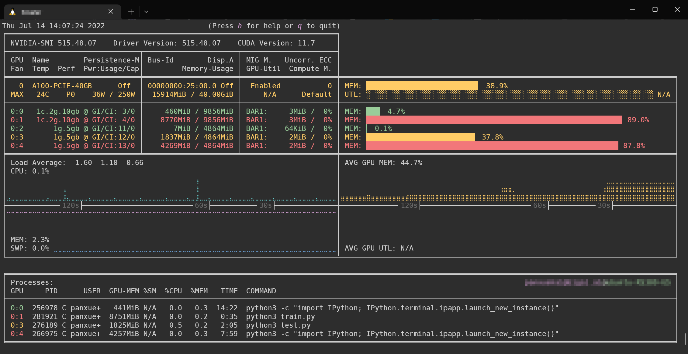

---
# This is the title of the article
title: 快速开始
# This is the icon of the page
# icon: more
# This control sidebar order
order: 1
# Set author
author: fengjk
# Set writing time
date: 2023-06-14
# A page can have multiple categories
category:
  - GPU服务器文档
# A page can have multiple tags
tag:
  - 使用技巧
  - 快速开始
  - GPU服务器
# this page is sticky in article list
sticky: true
# this page will appear in starred articles
star: true
# You can customize footer content
footer: Footer content for test
# You can customize copyright content
copyright: No Copyright
---

:::tip 前言
这是一个**快速使用**文档，会略去很多功能和细节，更多功能和方法可以参考[**详细文档**](../../GPUdocs)
:::

## **一、 登入服务器**

申请算力之后，管理员会给你容器的**IP、端口、账号、密码**，

**IP**一般为域名`位置.liandanlu.cn`，账号为`root`。

获得账密之后，你需要使用**Xshell**、**xterm**等软件连接，设置正确端口和账密之后就可以通过`ssh协议`连接进入容器系统，容器系统默认为`Ubuntu22.04`。

{width=65% height=auto}

{width=65% height=auto}

容器的使用与环境安装需要有一定的Linux和Shell基础，不会的需要加紧学习，这是基础中的基础。

## **二、 使用说明**

### **1. 容器技术**
连接进入容器之后，就可以开始使用服务器。

服务器的物理机一般有8张GPU，但是为了每个人使用方便、防止抢占、环境隔离、权限管理，我们使用**容器技术**来隔离每个人的使用环境，并且为每个容器分配固定数量的GPU和CPU线程。

:::note 容器技术
容器技术一项伟大的发明，可以简单理解为虚拟机，在系统层面隔离每个人的使用环境，并且可以将容器打包、迁移、复制，实现每个人环境可以在不同计算机上的准确复现。详情可以了解`docker`、`liunxcontainer(lxc)`技术。
:::
每个服务器的硬件配置和分配方式见[分封图]()

- 整个容器中的系统只属于使用者本人，可以任意重启、任意配置环境、任意修改，不用担心影响他人；

- 容器内也有与他人公用的资源，比如GPU与NAS存储。NAS存储详见[详细文档](https://docs.heartbreaker.icu/GPUdocs/)，下文主要介绍GPU分配；
>`nas-public-linkdata`，`nas-public-tju`等目录为NAS目录，为方便用户使用而设立，具有极大的作用，详情了解[NAS文档](https://docs.heartbreaker.icu/NASdocs/user)。

- 在容器名一般由`服务器名-人名`组成，比如`mars-huanghansheng`，在给管理员报告使用问题时，需要说清楚是哪台服务器的哪个容器出现问题，需要报告清楚`容器名`；

- 服务器上网与翻墙方式在不同地点有不同配置方式，见详细文档。

### **2. GPU分配原则**
由于物理机有8张GPU，同时分配给所有人会导致严重的抢占，因此我们使用容器进行资源控制，每个人的容器只能访问一部分GPU。

为每个人分配的GPU中，会包含**独占卡**和**共享卡**。
:::info
独占卡只有你能访问到，不会有其他人占用，防止抢占；

共享卡是为了提高显卡利用率，防止资源浪费。

每个人申请算力的时候可以根据自己的课题特点来申请资源，如确实需要长时间高频次占用显卡，那就申请多独占卡；自己使用的不太频繁，可以申请共享卡，共享卡的数量一般比较多。
:::

GPU可以细分到单人，如在`黄汉升`的容器内`nvidia-smi`，只能看到4张显卡

## 三、 注意事项

:::danger
请认真阅读并执行注意事项，否则会造成巨大的经济损失与安全隐患。
:::

实验服务器为多人使用，需要注意与其他人和平共处，并且有一部分使用禁忌，防止物理机损坏。

- 不要使用`gpustat`包监视显卡利用率，会导致显卡驱动损坏，建议使用[`nvitop`包](https://github.com/XuehaiPan/nvitop)，也十分美观和方便。
使用`pip install nvitop`或者`pip3 install nvitop`安装，然后直接在命令行调用`nvitop`即可。 

- **不要重新装nvidia显卡驱动**，容器内已经包含驱动，重装会导致容器环境损坏。
可以装**cudnn**和**nvcc**，但是高版本`pytorch`已经不需要自己单独装`cudnnn`这些的，直接复制[pytorch官网](https://pytorch.org/)安装命令即可。

- 可以自行修改容器密码，设置秘钥登录等。但是**禁止使用弱密码**，因为容器对外网开放，会导致病毒入侵。

- 禁止使用命令`pkill -u root`，这个命令会中止root的所有进程，root用户包含很多系统进程，请使用固定的进程号杀死程序，如`kill -9 progress_id`。

## 四、 使用建议

- 请经常将数据备份进入NAS。 在备份数据进入NAS时，`mv`指令有时会报错，可以使用`cp`指令。同时删除nas文件时也请检查清楚，防止误删（其实误删也可以恢复，但比较麻烦。）

- 较新型号的GPU需要使用高版本`pytorch`，注意代码兼容性问题

- 20系列以后的GPU使用混合精度运算，可以获得很好的加速

- GPU空闲、CPU不够、有类似硬件错误之类的问题及时报告管理员修复。

## FAQ

- 1. 如何在容器内挂载img镜像文件？
>

- 2. GPU服务器无法多卡并行（DP、DDP），是什么原因？
>