# NAS部署的细节文档

本文档主要讲述NAS的硬件安装于系统基础安装设置，主要工作已经完成，文档目的是为之后系统损坏或者服务器迁移时，NAS管理员可以更加完整认识系统的整体属性。

## 一、硬件选型与配置

实验室目前NAS服务器为华为RH 2288Hv3 服务器，**2U高度**的二手服务器，主要为硬盘位多，支持E5-26xx v3v4系列双路CPU。因此选择这个服务器作为实验室的主力NAS为核心存储服务器。


**服务器配置描述**：淘宝二手服务器，华为超聚变生产，2U高度RH2288H V3 服务器，前面板12个3.5寸热插拔硬盘位，后置2个2.5寸热插拔硬盘位，配置Riser转接卡与阵列直通卡。前置硬盘位留有6个3.5寸硬盘位未使用，暂时插了几个很杂的机械硬盘，没有存储数据。硬盘存在质保，5年内可以联系冯杰康进行售后。

!!! example 服务器硬件配置列表
    - CPU: E5-2609 V4 8核8线程  总共2颗
    - 内存: 16G RECC DDR4 2400内存 4根 总共64G
    - 硬盘：总共12盘位，目前主力使用
        - 机械硬盘：16T 希捷银河盘 总共6块主力存储池 组建Raid-5阵列（radi-z2），最终56T存储能力
    - 系统盘：120G金士顿+512G三星EVO 均为2.5寸固态硬盘 在后置硬盘位 组建Raid-1阵列（strip）
    - 缓冲盘：PCIE转M.2硬盘，128G梵想硬盘，作为读缓存
    - 网卡：后置原配双口**万兆**网卡
    - 显卡：使用Riser卡转接的**2080Ti显卡**
    - 阵列卡：2308直通卡
    - 电源：服务器750W电源


## 二、服务器硬件组装与配置

NAS服务器为标准的机架式服务器，组装流程符合所有服务器的标准，详细可以查看附件手册或者[官网手册](https://support.huawei.com/enterprise/zh/intelligent-servers/rh2288h-v3-pid-9901881)。一下只列出重要的几点和维护人员相关的信息。

1. **硬盘维护**：

    !!! danger 任何硬盘操作都是高危操作
        服务器硬盘架支持热插拔，按下按钮之后就可以弹出把手，拉出即可。硬盘安装在硬盘架上时，使用螺丝固定，之后打开把手推进去，等推进去之后在扣上把手。
        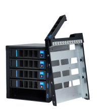
        ==服务器的硬盘位会有提示灯显示硬盘状态，黄色灯为**异常硬盘**，绿色灯为正常硬盘，因此一般只有硬盘故障时，替换黄色灯异常硬盘，否则不要动硬盘，数据安全问题重中之重。==
        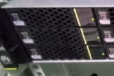
        上图为绿色灯，硬盘正常使用。

2. **内存安装**：内存安装是需要考虑位置的，不能随意位置插入，因此不同内存数量需要插得位置也不一样。
RH 2288H V3内存顺序如图
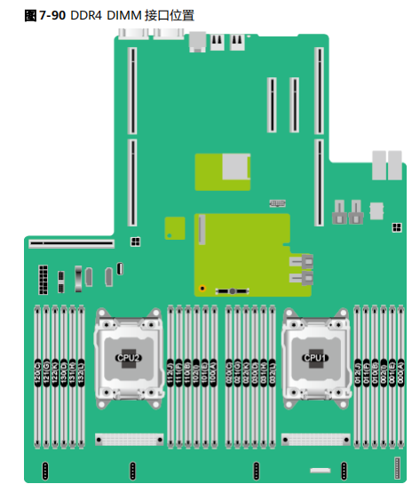
内存编号**从右到左编号**为A，E，I，B，F，J等等。
根据CPU的数量，安装顺序也不同，具体如图，按顺序安装就行。
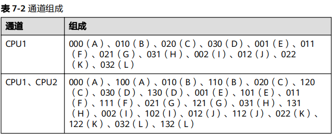

3. **后置硬盘仓**：后置硬盘仓的插线可能有人不注意，需要按照手册插入。
线缆如图
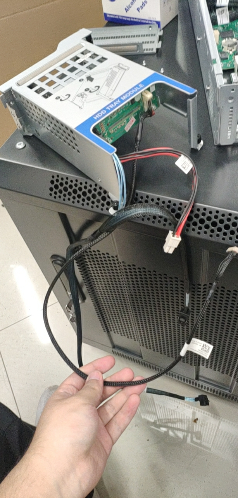
需要注意两点，
    - 细的长线为开关机信号线，需要接到前置硬盘背板上面。
    - 粗线为二分一的SAS线，长的那头（单头）需要连接前置硬盘背板的的SAS口（口的位置也有要求，看后面的连线图片即可）
       双头也需要注意，双头也分一个长头和短头，长头连接靠边的硬盘仓，短头连接中间的硬盘仓。服务器支持两个后置硬盘仓，如果只装一个，那双头就直接一个，**需要注意线材的长短与硬盘仓位置的关系，不然服务器无法对硬盘编号**。

**阵列卡的两个SAS线的顺序也有要求，不要反过来，具体看图。**。
官方线缆接驳图：
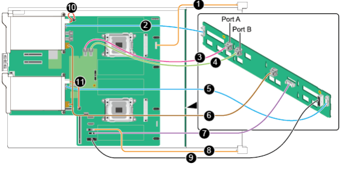
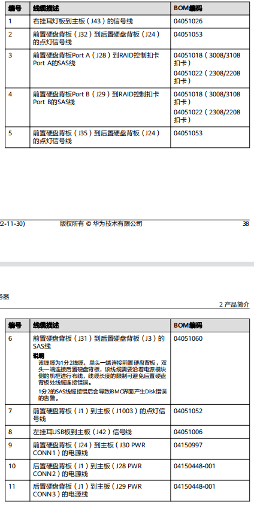

4. **后置网卡**：后置网卡更换为了原装万兆网卡，双网口，双IP
RH2288V3网卡识别不到的话，需要重置BIOS，这个在BIOS中有选项，恢复默认即可。


## 三、 服务器软件与系统配置

### 1. BIOS配置IPMI
机架服务器都是有管理网口可以用来管理服务器，以及连接服务器桌面（这样只用笔记本就可以查看服务器的显示了，不用去整键盘鼠标显示器了）。


**连接方法**：
- 使用网线连接服务器IPMI接口
- 设置笔记本的IP地址与服务器的IPMI的IP在同一网段
- 通过笔记本网页访问IPMI管理界面，登录后就可以操作服务器的上下电，重启，日志等信息，也可以使用他的远程桌面软件直接看到服务器的显示信息

当不知道IPMI的IP时，还是需要显示器，进入BIOS中修改器IPMI的IP等等。

### 2. TrueNAS安装、配置方法
操作系统选择TrueNAS Scale，[官网下载](https://www.truenas.com/download-truenas-scale/)最新的就可以，之后刻录进入U盘，进行安装。

ISO刻录U盘工具强烈建议使用[Ventoy](https://www.ventoy.net/cn/index.html)。
>Ventoy里面可以刻录多个操作系统iso，同时很方便刻录和安装使用
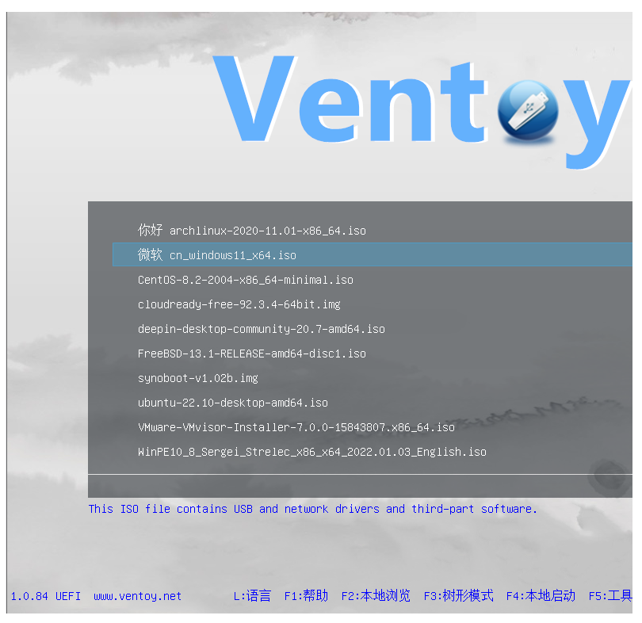

#### 2.1 系统安装
从U盘进入之后，选择TrueNAS的系统进入，之后就是选择系统盘。`空格键`是选择，选择两个硬盘的话就是组件双盘镜像备份
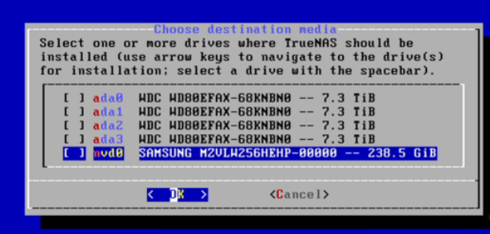
>注意：系统盘之后无法安装应用或者作为其他数据的存储，因此空间太多是浪费，32G甚至都足够。

安装完成shell显示如下，可以在其他局域网电脑是用登录


#### 2.2 系统基础配置
##### 2.2.1 系统登录

- 之后系统会自动安装完成，并且配置IP和网页端，就可以从网页端访问TrueNAS了。记得TrueNAS和访问机两个需要在同一网段，否则需要需要穿透80端口访问。
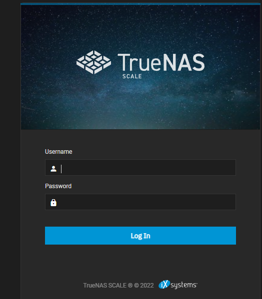

##### 2.2.2 配置时区，语言等
在下图的位置修改语言和时区。
配置时区为`Asin/Shanghai`，语言为简体中文，但是不一定翻译的很好
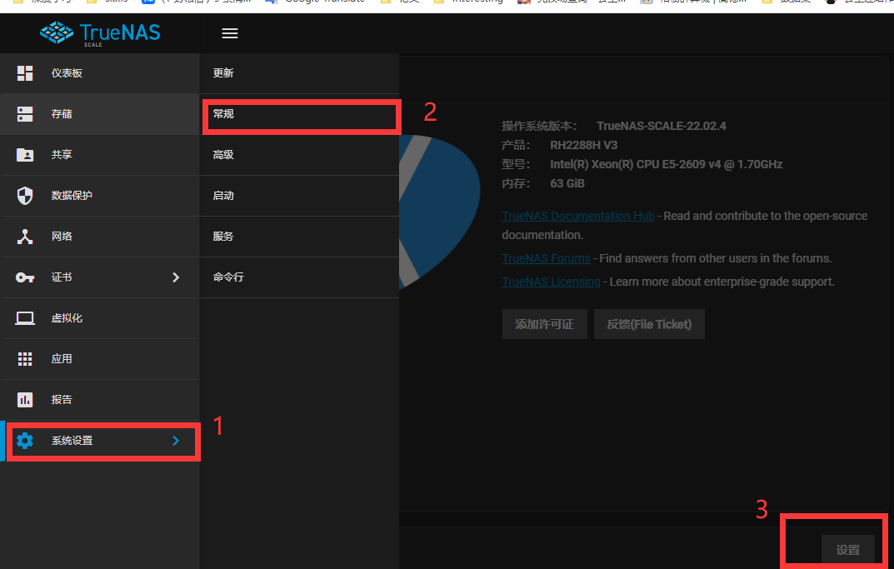

##### 2.2.3 ==配置存储池==

!!! danger 高危操作
    不要在已经配置好的服务器上尝试这些操作，数据安全重中之重

- 系统盘使用后置硬盘，在系统安装时已经选择了，因此不需要在存储池中选择。
- 主存储盘：
    6个16Tsata盘，**数据盘vdev**是作为数据存储的盘，同时选择`raid-z2`作为阵列方式
    128G nvme固态硬盘，**缓存vdev，L2ARC**，加速小文件的读取
关于vdev、存储池、数据库的关系参照另一篇ZFS介绍文章。//ToDo链接
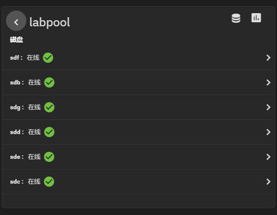

- 共享设置，下面为配置方法，用户使用方法参考用户手册//ToDo链接
    - 需要在windows上链接使用，直接使用**SMB共享**

##### 2.2.4 虚拟机安装
安装完虚拟机之后，就可以在虚拟机中使用**百度网盘**等下载工具，直接将数据下载到NAS之中；同时Windows虚拟机也可以管理NAS的上游**路由器**，可以修改端口映射等。

- windows虚拟机安装，首先将windows.iso镜像上传过去，选择进行安装
- 网络接口应该使用**网桥**，网桥可以让虚拟机和nas主机网络直通，否则双方无法连接。
- 虚拟机VNC远程网页端口为**5800端口**，如有需要需要穿透5800端口，或者使用向日葵远程。（5900端口不知道干什么，可以试试，感觉是应用程序使用的，5800端口开启就可以进行网页操作）。


##### 2.2.5 用户设置
见维护文档

##### 2.2.6 网络配置
见维护文档
    
#### 2.3 用户权限设置
见维护文档

## 四、 关于RH 2288H V3与致钛SC001 2.5寸固态硬盘的兼容性问题

将2.5寸致钛固态硬盘装入后置硬盘仓，装系统进不去。更换其他硬盘是没有问题的，更新过固件问题依然存在。询问过客服回答是民用硬盘在服务器上的兼容性不保证（可以理解）。目前可以当数据盘使用。

不存在黑致钛的问题，我的另外的致钛系统盘在超微服务器上使用良好，只是陈述一个事实。

详细故障表述：

硬盘安装在华为RH2288H v3的后置硬盘仓，安装完系统之后无法进入系统
- 系统类型：TrueNAS-scale 22.02.4 （尝试过ubuntu也不行）
- 硬盘类型：致钛sc001 2.5寸sata3  512G，1T两种均不行
- 购买渠道：京东自营
- 安装位置：后置硬盘架

安装完操作系统后报错会有好几种，比如：
```shell
GRUB loading..
Welcome to GRUB!

error: checksum verification failed.
grud rescue>
```
或者
```shell
GRUB loading..
Welcome to GRUB!

error：attempt to read ot write outside of disk 'hd0'
grud rescue>
```
或者
```shell
---[end Kernel panic -not syncing： VFS： Unable to mount root fs on unknow-block(0,0)]---
```

有时候安装系统时也会报错：
```shell
lsblk：CANT_FIND_SDC3_OR_SDCP3: not a block device
The TrueNAS installation on sdc has failed. Press enter enter to continue...
```

其他品牌硬盘不会出现这种问题。详细测试数据如下：
- 同样在后置硬盘架使用2.5寸金士顿120g固态、2.5寸HGST 1T机械，前置硬盘架1T西数金盘机械，4T希捷酷狼机械都是可以正常安装，正常进入系统
- bios更新为当前服务器最新版本了，服务器管理界面未显示任何硬盘错误信息，使用2308直通卡连接硬盘背板
- sc001固件已经更新为官网最新ZT016200
-  512G固态使用外接硬盘仓（硬盘仓使用USB链接服务器）接入服务器可以装系统、进入系统（这点很奇怪）
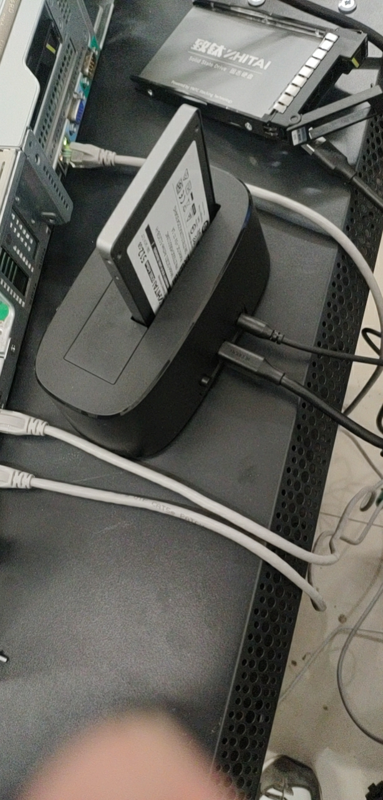
- 使用其他硬盘的系统进入之后，可以识别到致钛的硬盘，可以正常格式化组建zpool阵列，使用正常（但是有一次出现了raid降级情况，单块磁盘的zpool阵列，虽然降级但是可以正常写入，不知道原因）
-  安装系统的时候速度很慢，但是其他品牌硬盘安装速度很快，安装时会出现下图这种输出信息，但是似乎不影响，最后也会提示安装成功
- 我手头有4块512G固态，1块1T固态，都是致钛sc001,代换过，症状相同
- 使用超微4028GR-TR服务器上装系统使用正常