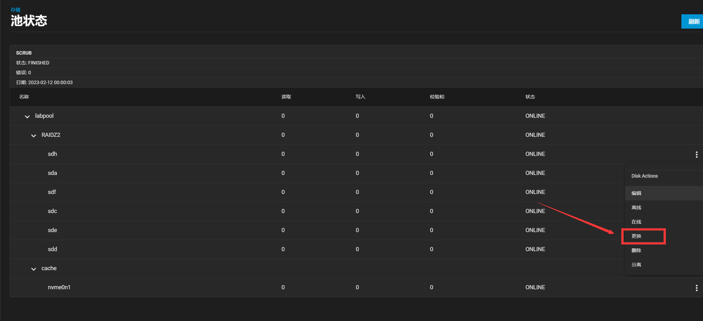
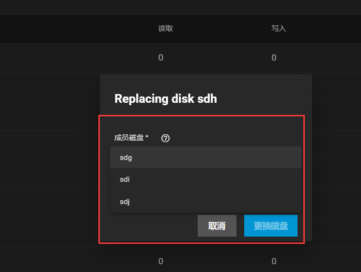
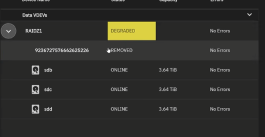
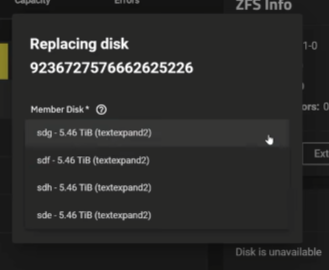
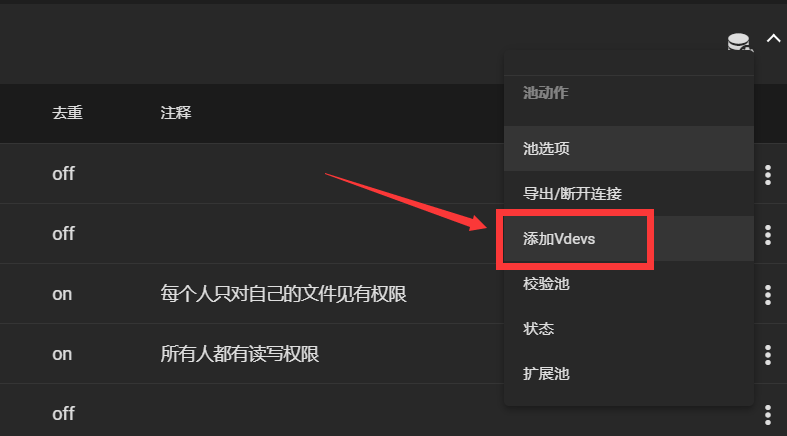
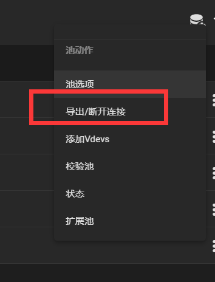
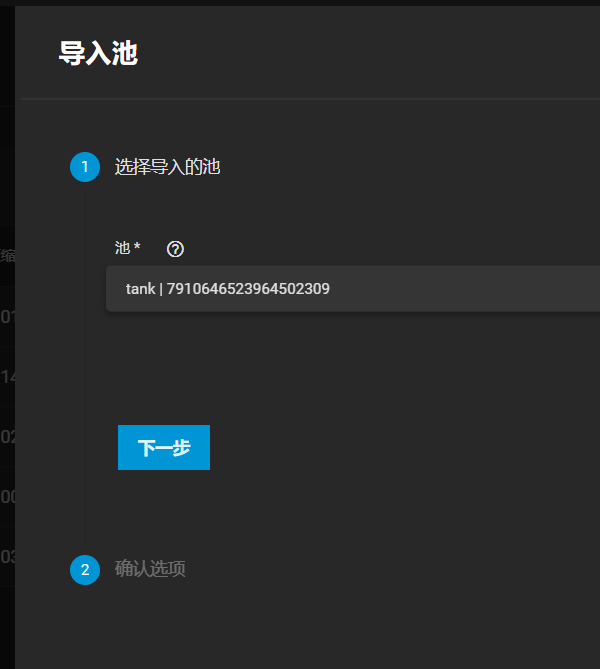
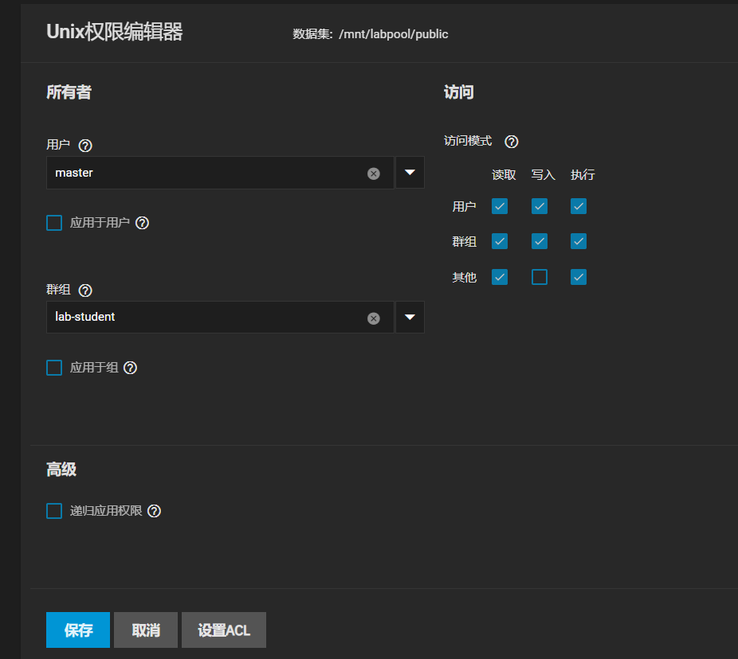
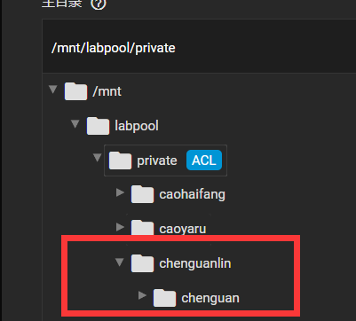
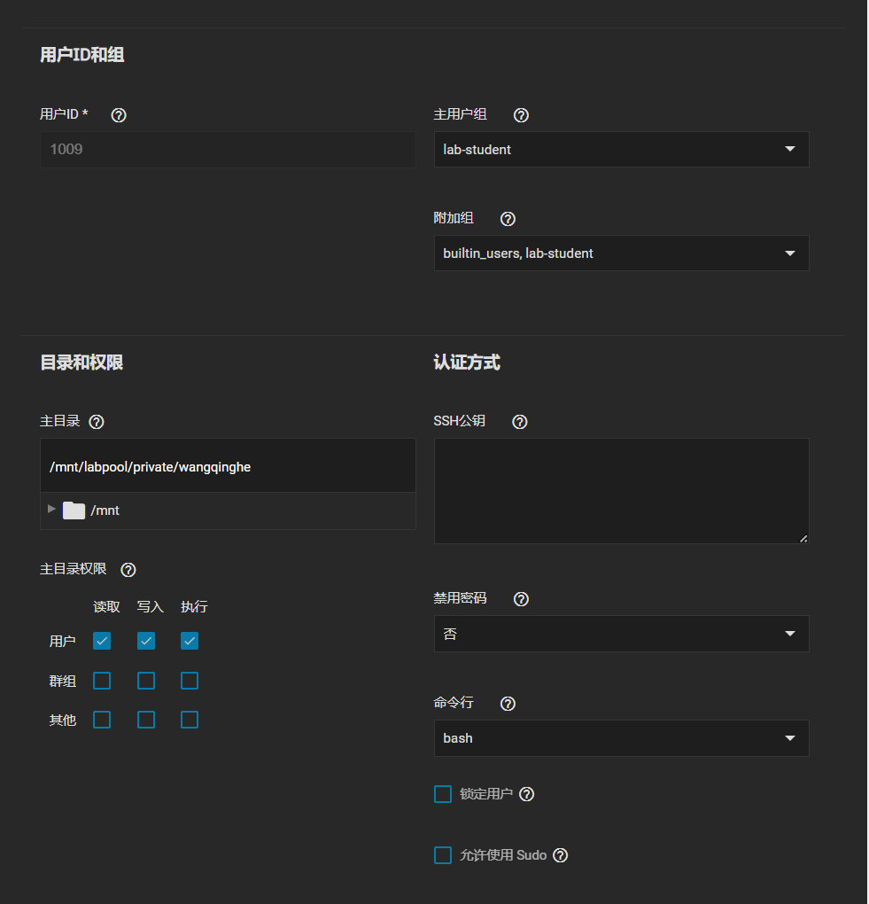

---
# This is the title of the article
title: NAS日常维护
# This is the icon of the page
icon: config
# This control sidebar order
order: 2
# Set author
author: fengjk
# Set writing time
date: 2023-03-22
# A page can have multiple categories
category:
  - NAS文档
# A page can have multiple tags
tag:
  - 管理维护
  - NAS
# this page is sticky in article list
sticky: true
# this page will appear in starred articles
star: true
# You can customize footer content
footer: Footer content for test
# You can customize copyright content
copyright: No Copyright

---

# NAS日常维护的文档

维护文档提供给管理员使用，用来做日常维护与常见故障处理。

[b站视频详解讲解TrueNAS系统](https://www.bilibili.com/video/BV1gG411T751/)，以下内容也是视频中重要知识点的总结和一些根据实际情况变化的补充

::: info  ToDo List
- [x] 实验室数据快照
- [x] public权限设置全公开
- [ ] private挂载进入GPU容器内
- [x] 新建一个数据集，用来保存
- [ ] 服务器加内存，梭哈是一种智慧
- [x] 寻找一种更优美的方式桥接网络 
:::

## 一、 存储池管理

:::tip 前置知识
    ZFS文件系统，存储池、vdev、数据集、硬盘之间关系。
:::

### 1. 硬盘替换（原先硬盘无损坏情况下）
使用目的：原先硬盘容量小，更换为大硬盘（只有将一个vdev中的全部硬盘更换，整个池的容量才会变化。不然容量是遵循木桶原理的）

- 进入存储池的`状态`中，选择一块池中的硬盘，选择`更换`
    
- 选择`更换`之后，可以选择任意空闲硬盘，**替换后的硬盘需要比原先硬盘大才行**；之后需要等待半天的数据导入，就完成了替换
    

### 2. 硬盘损坏/掉盘
::: danger 高危故障
    硬盘坏盘是最常见的故障，也是最危险的故障。
    
    需要及时替换新的硬盘，否则数据安全等级将要降级。

    在冗余范围内的损坏不会对数据有影响，但是需要及时更换新的硬盘，
    如要定期查看truenas的存储池是否online
**ONLINE为正常状态，在线状态；
DEGRADED为有硬盘损坏的状态，降级状态；**
:::
损坏可以分为一下几种
#### 2.1 硬盘掉线，硬盘本身没问题
解决方法：将原来的硬盘重新插入即可，系统会自动恢复。在掉盘期间也可以正常读写。
#### 2.2 硬盘掉线，硬盘本身出问题，这个硬盘内的数据无法恢复
解决方法：
- 拔出坏了的硬盘，之后进入存储池的设备管理中

- 选择新的好硬盘进行`replace`即可。**之后备份数据将会写入新的硬盘中，对于大容量NAS这个过程十分漫长，可能长达一个星期，期间一定做好监控，可能会有其他硬盘在恢复过程中损坏。（因为我们购买的硬盘属于统一批次，寿命可能相同）。**

### 3. 存储池扩展
如果原先服务器中的硬盘空间不够用了，除了新加硬盘之外，还需要将新加入的硬盘进行挂载。
挂载的硬盘可以建立新的存储池，也可以扩展原先的存储池。
- 建立新的存储池（**新建方法可以参考部署文档**）
这种方案会使得新的存储池路径和原先的路径不同，需要设置新的共享，如同普通电脑新加入一个`E盘`分区，会与原先的`D盘`访问路径不同，需要修改。但是这种方案可以提升一定的数据安全性，不同存储池之间的数据不影响。

- 扩展原先的存储池 (**下文重点介绍扩展存储池**)

::: note 现状说明
目前的NAS为6块硬盘组成一个`vdev`的存储池，可以添加新的`vdev`，使得原先的存储池变成两个`vdev`，从而在路径不变的情况下提升原先文件夹的容量。
**新加vdev的raid方式需要和原来的vdev相同，不然无法扩展。原先的vdev为6块盘的raid-z2，因此建议新加的盘也组成raid-z2，加6块盘，刚好服务器最多支持12块盘。**
:::
**ZFS文件系统中，vdev之间为raid-0（strip）组成存储池，一旦有一个vdev损坏，整个存储池的文件将无法恢复。扩展之后是无法缩容的。**
- 在存储池选项中选择`添加vdevs`，之后配置vdevs即可

### 4. 存储池迁移
如果更换服务器(或者原先TrueNAS系统损坏，重装系统)，可以直接将现在的所有存储池硬盘转移到新服务器上，然后让新服务器连接原来的硬盘中的池即可，**注意不要新建池，新建池会破坏原来的所有数据。当然，新旧两台服务器的操作系统都必须是TrueNAS。**

- 首先在原先服务器上断开(导出)存储池

    
- 在全部硬盘插入新的服务器后，在新的服务器上选择导入存储池即可。
    

- 由于在新的系统中没有之前的用户账号，所以需要重新设置数据集的权限，来方便在新的机器上访问。（或者在命令行里用root访问）

### 5. 存储池加密
::: danger 高危操作
没有那个金刚钻就不要揽瓷器活......
这个操作不做介绍，需要有足够的能力；否则秘钥丢失，数据火葬场。
:::
::: note 现状说明
实验室目前的NAS没有加密，今后也不打算加密
:::
### 6. 邮件提醒
::: note 现状说明
目前没有设置邮件提醒，比较复杂，后续设置人员设置完成后记得补充文档
:::
## 二、 数据集管理

数据集也就是存储池下的文件夹，可以设置共享与权限等内容。
后面可以根据需求新添加数据。

::: note 现状说明
目前主要有两个数据集`public`和`private`数据集，分别用来保存私密文件和公开文件。两个数据集均开启了`去重`与`压缩`，提高硬盘使用效率。因为大家的数据集重复率很高。

新建`resource`数据集，用于存放个钟公开数据集与其他资源文件，打算做成只读。
:::
### 1. 基本设置
基本只更改`压缩`，`去重`这几个选项即可，其他选项根据需求自己看着办。

### 2. 快照设置
可以为数据集添加定时快照功能，方便在数据误删除时恢复数据。
TrueNAS中的快照基本不占空间，创建很快，可以每天甚至每小时备份一次，然后每个备份存储一星期也没事。

### 3. 权限设置
::: danger 高危操作
错误的权限设置虽然不会让数据无法读取（因为root永远最大），但是会破坏原来的文件私有性或者公有性。不建议随意更改。
:::

::: warning 现状（bug）说明
`private`的权限为ACL，但是似乎和普通的通常权限没有什么区别，因为目前`私有`的控制是由`主目录`中的权限只有所属人有权限来控制（参考下一章“用户管理”）。  能跑就不要动，按理来说改回UOG权限也没问题，但是不要选择递归，这样会覆盖下面的`主目录`设置的权限，破坏私有性。
:::
:::  warning 现状（bug）说明
现状(bug)说明
`public`权限有问题，没办法让新建文件夹有读写权限
- 现在服务器有两个数据集`public`和`private`。
    `public`的所属人是master，所属组是`lab-student`。正是这样，组内的学生才对其有全部读写执行权限。
    
:::
::: warning
权限目前有点乱，后面再改吧，配合nextcloud容器来控制
:::

## 三、用户管理
::: tip 前置知识
    linux的用户、组、所有人、所属组概念（即）
:::
用户主要管理在`证书`这个项目下面。
需要为实验室每个人创建一个用户，方便他们登录。

::: warning 现状（bug）说明
    系统目前同时拥有一个管理员用户`master`，属于`admin`组（本来想叫master组，但是起错名字了），不过目前没有管理员权限，，，，没设置好，还是用root敲命令行吧
:::

### 1. 用户组
在创建新用户时，默认会创建一个同名的组，**但是我们不这么做，为了方便管理，我们创建了一个名为`lab-student`的用户组，加入所有实验室学生**

### 2. 创建用户

为没有账号的同学创建新的账户，请按照`使用指南`中的账户名、密码格式创建用户。

在创建新用户时注意
- `全名`只是一个标记，没有什么用，`用户名`才是登录用的，但只有8位。一般用全名前8位（输入全名后，系统会自动节选前8位）
- 取消创建新的用户组，设置主用户组为`lab-student`，设置附加组为`builtin_user`
- 设置主目录位于`private`下，文件名为全名。
**第一次创建主目录时，他会在全名文件夹下新建一个缩写名的文件夹，这不符合我们的管理规范。因此在创建完之后，需要重新编辑新用户的主目录为`private`下的全名文件夹**
下图为目录设置时产生的嵌套现象，我们需要再新建完用户，重新设置他的主目录，才能让全名文件夹为他的私有目录
    
- 权限设置，只有用户本身有读写执行权限，其他人没有任何权限，这样能保证私密性。

设置一览图

## 四、共享设置

目前使用的共享设置有`SMB`共享与`webdav`共享