---

# This is the title of the article
title: 如何使用NAS
# This is the icon of the page
icon: page
# This control sidebar order
order: 1
# Set author
author: fengjk

# Set writing time
date: 2023-03-19
# A page can have multiple categories
category:
  - NAS文档
# A page can have multiple tags
tag:
  - 使用技巧
  - NAS
# this page is sticky in article list
sticky: true
# this page will appear in starred articles
star: true
# You can customize footer content
footer: Footer content for test
# You can customize copyright content
copyright: No Copyright

---

>NAS是什么

>NAS：网络附加存储设备。就是一个网盘，不过更加方便与快速，可以直接挂载在电脑内，当做本地磁盘使用。同时也有一定的冗余防灾能力和超大的存储空间。

## 前言
你还在为云盘速度拉胯而苦恼吗？ 你还在为实验数据过大而焦躁吗？ 你还在为多台电脑数据不容易同步而哭泣吗？
还在为百度云账号数量限制而寻求验证码吗？ 还在和同学使用QQ传递文件吗？


那就来使用实验室NAS吧，方便快捷，量大管饱。

::: info 现状说明
目前拥有存储空间 56T（暂时只开放40T以供大家使用，后续扩容会更新文档），磁盘双冗余（坏两个磁盘数据都不会丢）。

记住我们的域名`炼丹炉（liandanlu）.cn`我们今后的服务器工程也将从这个域名展开
:::

::: note  ToDo List
- [x] 校外的NAS访问
- [x] Linux系统适配（NFS）共享  modify: 因为nfs有权限问题漏洞，已改用smb共享
- [x] Window10系统共享（SMB）
- [ ] MAC上的使用文档
- [ ] 手机安卓系统适配
- [x] GPU服务器默认挂载
- [x] 域名登录，目前域名为`lab.liandanlu.cn`
- [x] 文档网页化，做成在线的
- [x] 公有文件夹使用WebDAV共享，可以挂载方便一点
- [x] 设置`resource`文件夹
- 文档做成在线网站，方便实时更新与访问
- 非校园网的访问，成为真·云盘
- GPU服务器和NAS的集成使用
- 做域名解析，使用域名访问，无需更改ip
- 212内网千兆速率
- 其他系统使用测试
- **可能需要前端大佬、网络带师、系统专家来优化体验** 
:::

## 一、 使用方法

::: info
目前NAS挂靠在链数公网内，所有网络情况都可以连接到NAS了，不过因为运营商封禁445端口，远程链接仍然比较费事。（印度佬，Win10共享端口不要写死啊，凎。）

出于权限管理考虑目前远程连接是比较费事的，链数、实验室成员的权限均有不同。

已修改使用WebDAV协议共享，可以在浏览器访问，用软件就能挂载。

请严格保证密码安全，不要将密码共享给有泄露可能的人，数据安全重中之重。
:::


::: note  文件目录说明
因为NAS就相当于是个大磁盘，这个大磁盘我们建立了3个目录，功能与用途如下：

- `private`: 私有文件夹，存放自己的私密文件，管理员已经设置了权限屏蔽，除了自己的账号，别人无法访问；
- `public`: 公共文件夹，所有人都可以访问和使用，请建立自己的文件夹，以避免文件混乱。会帮大家把自己的文件夹挂载进入GPU服务器内，这是主要的工作目录。
- `resource`: 资源文件夹，存放数据集，软件资源，共享文件等等。

一般`private`存放自己的私有文件，但是由于权限问题，GPU服务器只会挂载各位的`public`文件夹的内容以及`resource`文件夹，所以怎么存放东西自己权衡。

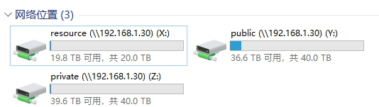

:::


## 1. Windows远程连接（链数公司以外的地方）

::: tip 账密系统解释
实验室整体使用服务器时，会接触到3个账户密码：

- 访问共享资源时使用的是实验室的公共账户`webdav`账户；

- 访问私有资源时使用的是个人账户`名字全拼前8位`；（当然，在`1.3节`中介绍的方法也可以使用个人账户访问公共数据）

- 访问GPU服务器使用的是GPU服务器的账密，为根据用途设计的主机名和密码，用户一般是`Linux`的`root`。
:::

### 1.1 Windows 访问共享资源 

如果你只需要访问与查看数据（不修改、不上传），那么只需要浏览器就行。手机、平板、电脑、各种系统的浏览器都可以，真正的跨平台。

- 在`浏览器`地址栏输入网址`https://lab.liandanlu.cn:40081/public`或者`https://lab.liandanlu.cn:40081/resource`。

>端口后面的路径表示需要访问的资源路径，目前开放的文件夹有`public`和`resource`。

之后输入密码，就可以在浏览器内在线观看和下载数据，在线看视频也是可以的。

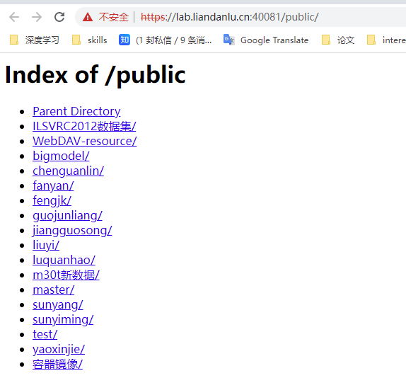


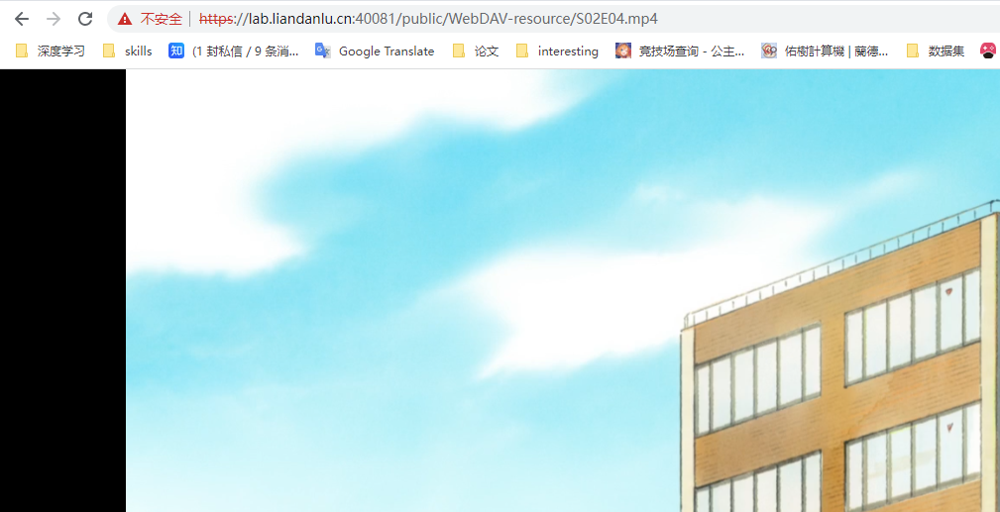


### 1.2 Windows 挂载共享文件夹

你可以使用软件将共享文件夹挂载在本地磁盘中，跟使用本地磁盘一样使用NAS，同时也可以上传数据。就是需要你下载一个软件[RaiDriver](https://www.raidrive.com/)。

挂载之后你可以像使用自己的本地磁盘一样使用NAS。

- 下载软件[RaiDriver](https://www.raidrive.com/)

- 安装之后，添加一个新的连接，配置如下

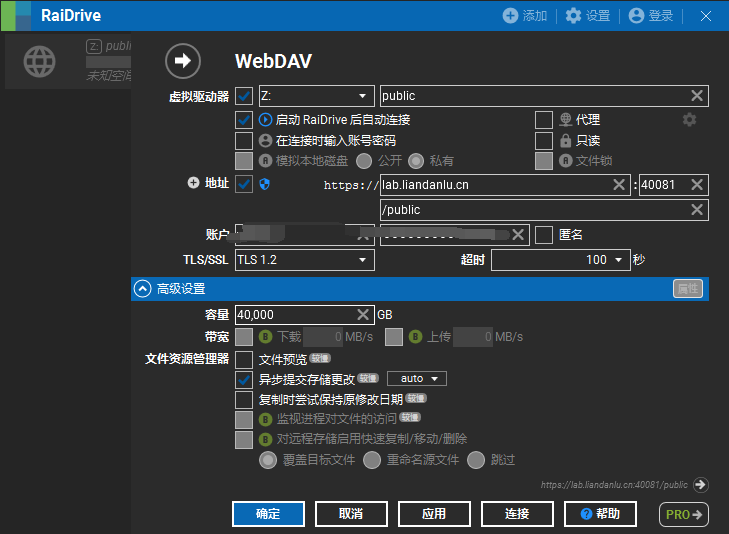

其中地址的域名和端口也就是上一节所输入的网址，后面的路径`public`和`resource`分别对应两个不同的共享文件夹。

`容量`需要自己填写，因为他没法识别正常容量，可以填也可以不填，`public`有40T，肯定够用。

- 之后你的`此电脑`内就会多出来两个分区


- 你可以上传文件、下载文件、编辑文件，跟使用你的本地磁盘一样，数据会**实时**同步到NAS里。

**如果你有多个设备连接NAS，那么你的多的设备的数据都能同步。**


### 1.3  Windows 挂载私有文件

私有文件只有自己的账户可见，其他人无法访问自己的私有文件夹，但是挂载比较麻烦（在Windows上比较麻烦）。 也可以不挂载，不影响使用。

:::details

这个方法会占用你的机器回环地址（127.0.0.1）的445端口，而且也只能连接学校这一个NAS系统。如果有其他特殊需求，参考[这个博客](https://blog.csdn.net/zhungcan/article/details/110912546)，下面的方法将对你不适用。

- 设置端口转发，将电脑的`445`端口访问转发到远程的`40000`端口上。
以管理员身份打开`cmd`,**（注意是cmd。powershell可能会出现奇怪的错误。）**

输入下面命令:
```shell
sc stop lanmanserver
sc config lanmanserver start=disabled

netsh interface portproxy add v4tov4 listenport=445 listenaddress=127.0.0.1 connectport=40000 connectaddress=lab.liandanlu.cn

net stop iphlpsvc
net start iphlpsvc
```

>解释：关闭本机的`lanmanserver`服务，释放`445`端口。 

>之后，将本机的`445`端口的信息全部转发到`lab.liandanlu.cn`的`40000`端口上。

>然后重启ip helper服务。

- 重启电脑
- 打开任何`文件夹`或者`此电脑`， **注意不是浏览器、不是浏览器、不是浏览器**，是文件资源管理器；
- 在地址栏输入`\\127.0.0.1`， **注意斜杠的方向**；


    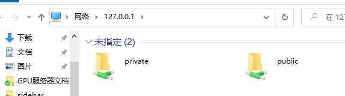

- 之后点击文件夹，如果未登录账户，则需要输入账密。可以选择`记住用户`，之后登录就不需要输入密码了。

::: tip 
    由于所采用的NAS的系统限制，用户名没办法很长，所以目前账密编码为
    账户：`姓名拼音的前8个字母`
    密码： `线上文档隐去密码编码`

    如`黄汉升`的账密分别为
    账号：`huanghan`
    密码：`线上文档隐去密码编码`
:::


- 之后在对应目录中寻找自己专属文件夹即可

- 毕业后可以删除配置的端口转发，使用如下命令：
```bash
netsh interface portproxy delete v4tov4 listenport=445 listenaddress=127.0.0.1 
```

:::

## 2. Linux（ubuntu为例）远程连接 //ToDo

## 3. 手机连接 //ToDo

## 4. 链数公司内部 //ToDo

## 5. 挂靠在liandanlu系统路由器下的服务器连接 //ToDo


## 二、 进阶技巧

## 1. 云盘资料下载到NAS中   

我们在链数准备了一个Windows主机，利用向日葵连接上去之后，就可以下载东西，下载完成可以直接拖到NAS里。

因为NAS与GPU服务器相连，所以文件放入NAS之后，在GPU服务器上是可以直接访问的。（相当于从云盘直接下载到了GPU服务器里）。

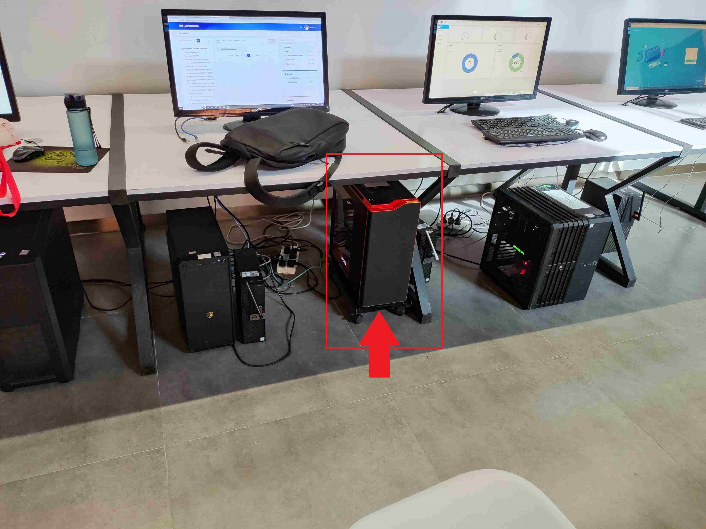

- 连接远程桌面

::: tip
    向日葵账号：线上文档隐去账密
    密码：线上文档隐去账密
:::

- 连接之后，就可以使用Windows主机内的云盘软件下载你的数据集；目前Windows主机长期开启，其中登录有实验室`百度网盘超级会员账号`，可以直接下载；

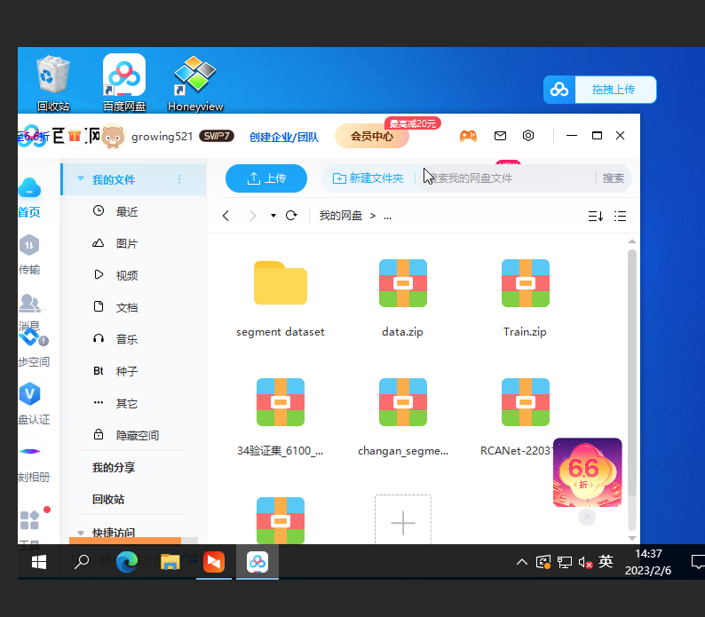

- 下载完成之后，将Windows内下载的数据，迁移到NAS内；记得及时清除自己Windows内的文件，或者直接下载到NAS内也行；

    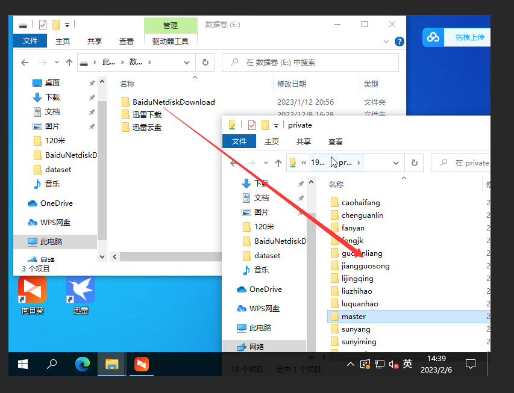


::: note 百度网盘账号使用
    因为百度网盘有登录设备数量限制，我们今后均使用向日葵连接进入Windows主机，下载完成之后放到NAS里。

    需要的话再自己从NAS里下载，NAS带宽速度还可以。不要再在个人电脑上登录实验室百度网盘账号了。
:::


<!-- ## 2. Windows上的挂载与用户切换

#### 1.1 NAS挂载到本地

NAS挂载到本地之后，就可跟使用本地磁盘一样使用NAS了；

- 直接挂载目录，之后在此电脑中就可以看见

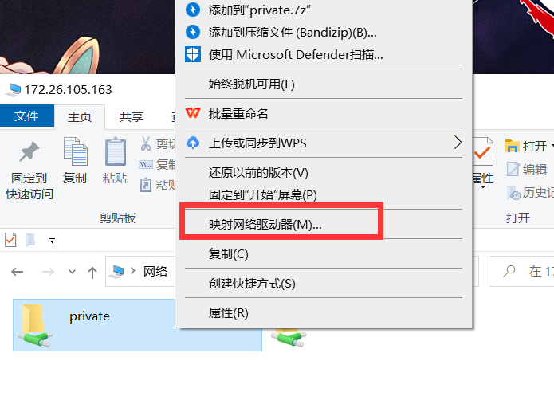 


- 或者可以直接为自己的目录创建`快捷方式`，之后通过快捷方式就能直接进入目录

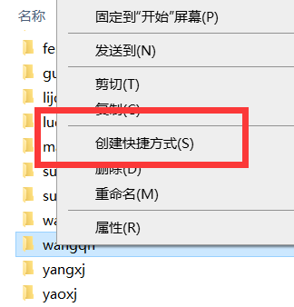


#### 1.2 切换登录账户

需要登录其他用户或者清楚原有的"记住用户"时，需要进行的下面的操作。

- `控制面板`-`用户账户`-`Windows凭证` ，之后编辑或者删除之前的凭证即可

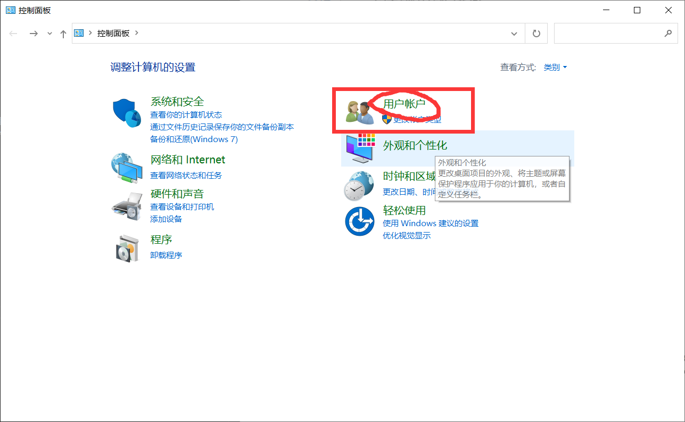

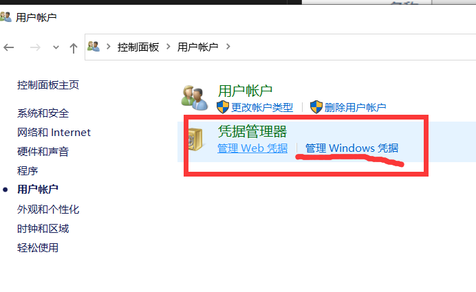

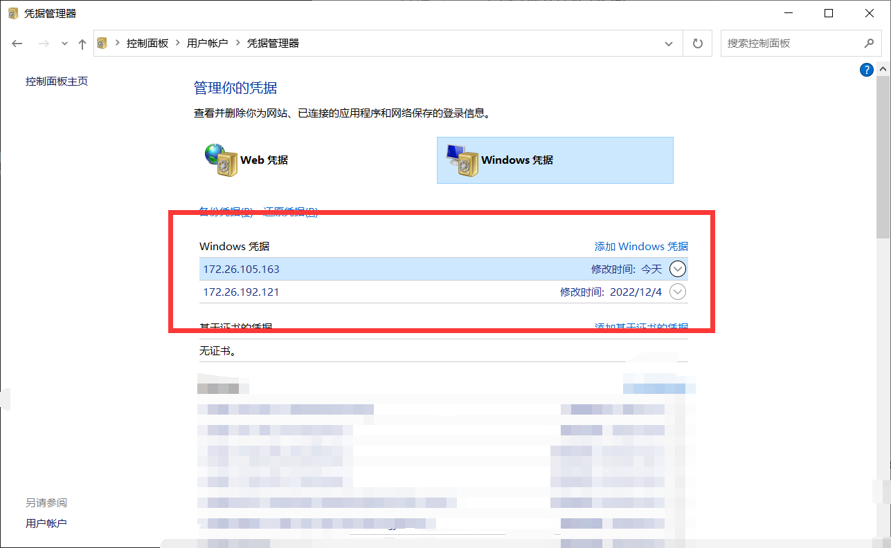
  -->


## ==2. 多设备文件同步==

这个算是比较重点也比较有用的功能了，云上数据，yyds。

>简单的说就是，数据都放NAS里，然后所有设备连接NAS之后，就可以完美进行同步。

基于以上原理，我们可以实现以下操作。

- 在手机上实时观看NAS内的日志文件（由GPU服务器生成）；

- 在Windows上编辑代码，之后可以直接在GPU服务器上运行；

- 下班后把论文拖到NAS里，然后回宿舍用笔记本连接NAS看；

...

云上空间，尽情使用。

## 三、 连接速度（上传下载速度）
- `链数内网速度`：1000Mbps
- `GPU服务器连接速度`：10Gbps 
- `其他外网连接速度`：100Mbps 


