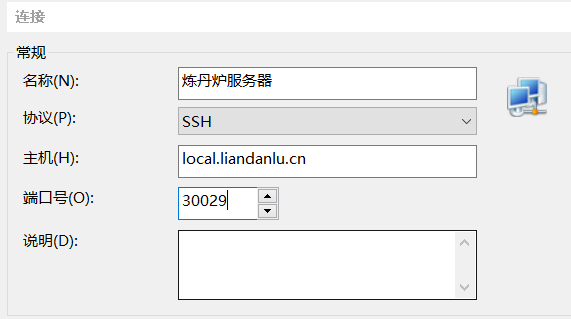
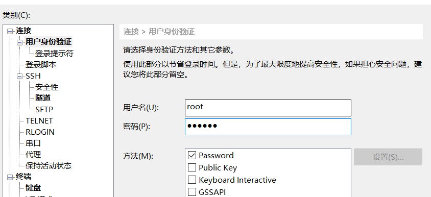
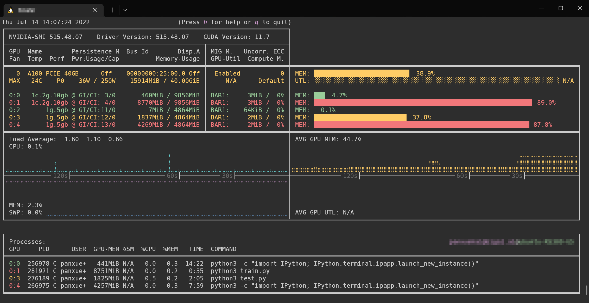

---
# This is the title of the article
title: 登录
# This is the icon of the page
icon: user-plus
# This control sidebar order
order: 1
# Set author
author: fengjk
# Set writing time
date: 2023-08-31
# A page can have multiple categories
category:
  - GPU服务器文档
# A page can have multiple tags
tag:
  - 使用技巧
  - 快速开始
  - GPU服务器
# this page is sticky in article list
sticky: true
# this page will appear in starred articles
star: true
# You can customize footer content
footer: Footer content for test
# You can customize copyright content
copyright: No Copyright
---

:::tip 前言
这是一个**快速使用**说明，会略去很多功能和细节，更多功能请阅读全部用户手册。
:::

## **登入服务器**
---
申请算力之后，管理员会给你容器的**IP、端口、账号、密码**，

**IP**一般为域名`位置.liandanlu.cn`，账号为`root`。

获得账密之后，你需要使用**Xshell**、**xterm**等软件连接，设置正确端口和账密之后就可以通过`ssh协议`连接进入容器系统，容器系统默认为`Ubuntu22.04`。

容器的使用与环境安装需要有一定的Linux和Shell基础，不会的需要加紧学习，这是基础中的基础。

{width=400 height=auto}

{width=400 height=auto}

---
## **注意事项**

:::danger 
请认真阅读并执行注意事项，否则会造成**巨大的经济损失与安全隐患**。

实验服务器为多人使用，需要注意与其他人和平共处，并且有一部分使用禁忌，防止物理机损坏。
:::

- **禁止使用`gpustat`包监视显卡利用率**，会导致容器显卡驱动损坏。

    **解决方案**：建议使用[`nvitop`包](https://github.com/XuehaiPan/nvitop)，也十分美观和方便。
    :::details 使用示例
    使用`pip install nvitop`或者`pip3 install nvitop`安装，然后直接在命令行调用`nvitop`即可。 

    
    :::
- **不要重新装nvidia显卡驱动**，容器内已经包含驱动，重装会导致容器环境损坏。

    可以装**cudnn**和**nvcc**，但是高版本`pytorch`已经不需要自己单独装`cudnnn`和`cuda`，直接复制[pytorch官网](https://pytorch.org/)的安装命令即可。

- 可以自行修改容器密码，设置秘钥登录等。但是**禁止使用弱密码**，因为容器对外网开放，会导致病毒入侵。
    :::details 密码说明
    `容器密码`、`nas密码` 这两个密码没有关联，在容器内使用`passwd root`命令只能修改容器的登录密码，***nas密码不会变***。
    :::

- **禁止使用命令`pkill -u root`**，这个命令会中止root的所有进程，root用户包含很多系统进程，请使用固定的进程号杀死程序，如`kill -9 progress_id`。

    或者使用`reboot`命令**重启容器**，重启解决90%问题。

---
---
## **使用建议**
:::tip 
按照推荐方式使用，可以带来使用体验的提升，加快你的实验进度。
:::
- 请将重要数据定期备份进入NAS，NAS系统具有很高的容灾恢复能力。 在备份数据进入NAS时，`mv`指令有时会报错，可以使用`cp`指令。同时删除nas文件时也请检查清楚，防止误删（其实误删也可以恢复，但比较麻烦。）

- 较新型号的GPU需要使用高版本`pytorch`，注意代码兼容性问题；

- 20系列以后的GPU使用[混合精度运算](https://zhuanlan.zhihu.com/p/408610877)，可以获得很好的加速；

- 将数据集、日志等存放入NAS，不要在本地磁盘存放过多数据，本地磁盘空间有限、安全性低；

- GPU空闲、CPU不够、有类似硬件错误之类的问题及时报告管理员修复。

---
---
 
:::warning 🎁请支持本项目发展🎁
有文档不清晰、软硬件问题、网络不通、对项目有兴趣的话都可以联系管理员，既能解决你的问题也能方便未来面对相同问题的人。
fengjk12138 at qq.com
:::