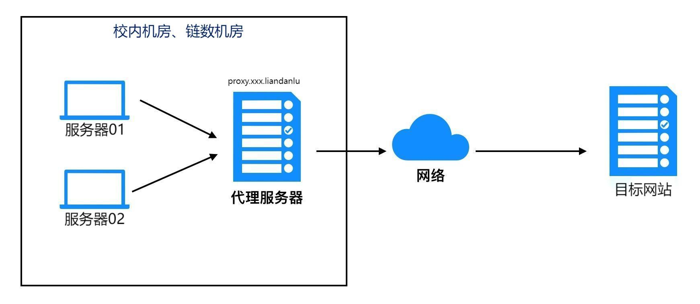

---
# This is the title of the article
title: 容器网络配置
# This is the icon of the page
icon: network-wired
# This control sidebar order
order: 2
# Set author
author: fengjk
# Set writing time
date: 2023-08-31
# A page can have multiple categories
category:
  - GPU服务器文档
# A page can have multiple tags
tag:
  - 使用技巧
  - 快速开始
  - GPU服务器
# this page is sticky in article list
sticky: true
# this page will appear in starred articles
star: true
# You can customize footer content
footer: Footer content for test
# You can customize copyright content
copyright: No Copyright
---


## 两地网络状况

:::tip 链数服务器
链数服务器可以直接上网，但是对于安装国外软件较慢的情况，我们提供了一些解决方案，**通过代理加速外国资源访问**。
:::

:::tip 校内服务器
校内服务器无法直接上网，只能正确配置代理之后才能上网。
:::

>本文的很多内容和[上一节](./environment.md)重叠，本文给出了一些解释和更简便的方法。


我们使用上网方式，称为“代理”或者“代理上网”。

:::info 代理上网原理（翻墙原理）
**现状**：我们需要访问网站Web https://google.com:443，但是
机器A（服务器）无法访问Web，机器B（代理服务器）可以访问Web。

机器A和机器B可以互相访问。

**需求**：使机器A可以访问网站Web。

**做法**：机器A把自己需要访问的网站发送给机器B，让机器B访问网站Web，并将访问结果传送给A。

我们使用`export`导入环境变量，然后命令行程序会把自己的访问请求转发给环境变量，让环境变量的服务器代为访问。



**代理服务器**：`proxy.xxx.liandanlu.cn`地址所对应的电脑在校内A417房间或者链数的Windows下载机。
:::

<!-- ## 代理上网
根据需要加速的命令不同，配置方法也不同。

### **1. 国内资源访问**
- 链数机器可以自由访问国内网站，如gitee等资源。不需要做任何操作，不过在使用代理后，访问国内的网站可能会有影响，详情请阅读下一节。

- 校内服务器无法直接上网，请按照不同命令的区分

### **2. 国外资源加速**
>可以加速的命令包括: `pip`， `git clone`，`conda`、`wandb`、`wget`、`curl`等

- 设置环境变量`ALL_PROXY`，`HTTPS_PROXY`，`HTTP_PROXY`:
```shell 
export ALL_PROXY=socks5://proxy.linkdata.liandanlu.cn:10808
export HTTPS_PROXY=http://proxy.linkdata.liandanlu.cn:10809
export HTTP_PROXY=http://proxy.linkdata.liandanlu.cn:10809
```

- 之后使用这些命令就可以加速。


:::info 解释
其中，`socks5`、`http`为通信协议；`proxy.linkdata.liandanlu.cn`为代理机（机器B）的IP地址；`10808`、`10809`为机器B接受信息的端口。
:::

### **3. 特殊命令的加速**

- **`apt`、`apt-get`命令**：参考[上一节](./environment.md)

- **`docker`命令**：参考搜索引擎

- **其他命令如何配置**：
如果你的命令不在上述列表之中，那么需要在谷歌中搜索`xxx如何设置代理`。
 -->

---
## ==通用的简便的配置方法==


- 在`~/.bashrc`文件中增加以下内容：
  ```bash
  function set_proxy(){
      export HTTP_PROXY=http://proxy.linkdata.liandanlu.cn:10809
      export HTTPS_PROXY=$HTTP_PROXY
      export ALL_PROXY=socks5://proxy.linkdata.liandanlu.cn:10808
      export http_proxy=$HTTP_PROXY
      export https_proxy=$HTTP_PROXY
      export all_proxy=$ALL_PROXY
  }
  function unset_proxy(){
      unset HTTP_PROXY
      unset HTTPS_PROXY
      unset ALL_PROXY
      unset http_proxy
      unset https_proxy
      unset all_proxy
  }
  ```
  之后运行：
  ```bash
  source ~/.bashrc
  ```

- 然后**需要使用代理时**，在命令行输入
  ```bash
  set_proxy
  ```
  之后再使用`pip`，`git clone`，`wget`，`conda`，`wandb`，`curl`等命令就可连接代理服务器实现加速了。

- **取消使用代理时**，命令行输入
```bash
unset_proxy
```

:::tip
- 如果你得服务器在校内，请注意替换字符串中的`linkdata`为`tju`。

- `set_proxy`也只对调用他的terminal有效。

- 检查`set_proxy`是否成功的方法为：
  ```bash
  echo $https_proxy
  ```
  如果设置成功，则会有`http://xxxx`的输出。

:::


----

## **使用代理时的问题说明**

- `conda`时报错`OSError`，确实应有的包
  ```text
  ERROR: Could not install packages due to an OSError: Missing depencies for SOCKS support.
  ```

  **解决方法**：安装`pysocks`包，在nas中有存放：
  ```bash
  pip install ~/nas-resource-linkdata/常用软件/whl/PySocks-1.7.1-py3-none-any.whl
  ```

- `apt`等命令无法代理，`set_proxy`后依然无法联网。
  
  **原因**：`apt`等命令有时无法直接调用环境变量，需要我们手动设置。
  
  **解决方法**：与上一节的方法相同，在命令后手动导入
  ```bash
  sudo apt update -o Acquire::http::proxy=$HTTPS_PROXY
  ```

  也可以自己去搜索，修改`apt`配置文件，实现永久代理。


- **更多其他命令的代理问题需要进行搜索，查看这个命令如何使用代理，将教程中的代理地址替换为我们的代理地址即可。**

- 更极端的解决办法，请搜索`ssh隧道上网`，将网络请求转发到自己电脑上。
