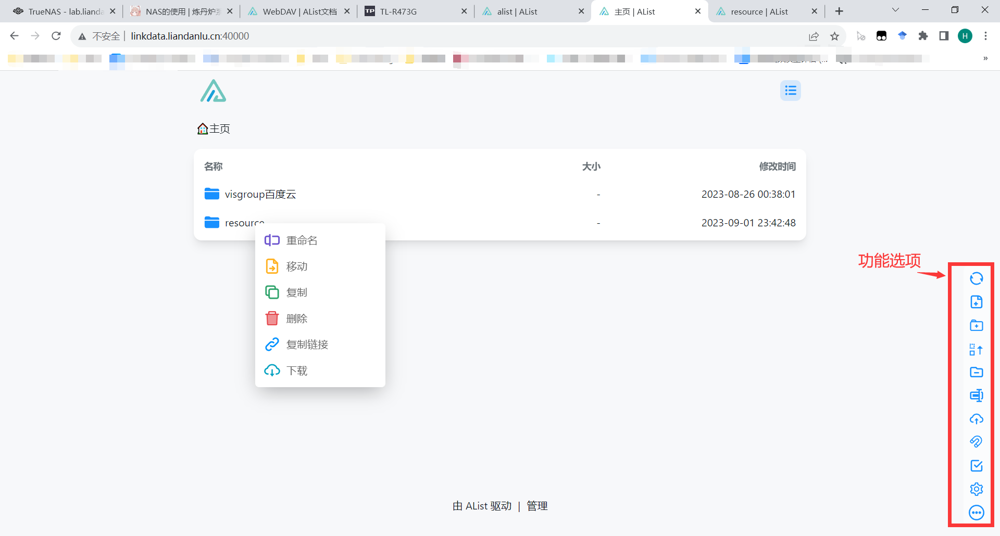

---
# This is the title of the article
title: AList网页
# This is the icon of the page
icon: wifi
# This control sidebar order
order: 1
# Set author
author: fengjk
# Set writing time
date: 2023-09-01
# A page can have multiple categories
category:
  - GPU服务器文档
# A page can have multiple tags
tag:
  - 使用技巧
  - NAS存储
  - GPU服务器
# this page is sticky in article list
sticky: true
# this page will appear in starred articles
star: true
# You can customize footer content
footer: Footer content for test
# You can customize copyright content
copyright: No Copyright
---

:::tip 前言
AList网页使我们的NAS的网页端，使用浏览器就可以打开。拥有极高的系统兼容性和方便程序。

同时拥有众多的功能。

只需要在浏览器内输入网址就可以打开网页端。
:::

## **连接方法**

在浏览器内输入网址：`http://linkdata.liandanlu.cn:40000`

## **使用展示**

可以观察到，网页端拥有实验室百度云目录和nas目录，可以下载、上传、分享自己需要的文件。

## 更多功能可以在功能展示章节看到
