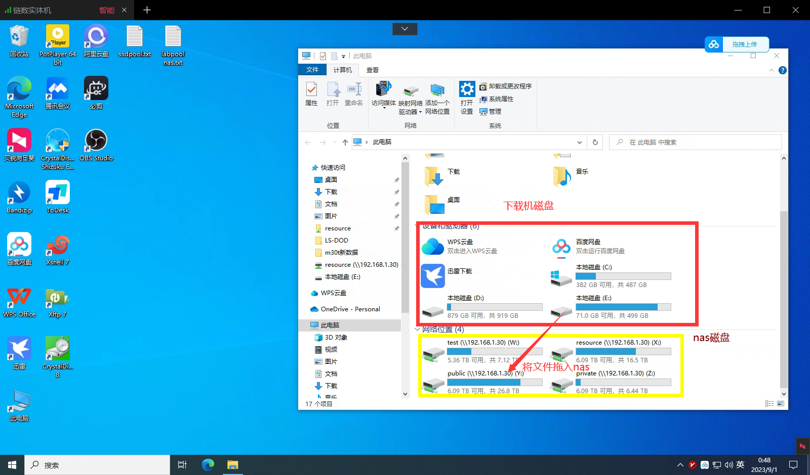

---
# This is the title of the article
title: 下载数据集
# This is the icon of the page
icon: download
# This control sidebar order
order: 1
# Set author
author: fengjk
# Set writing time
date: 2023-09-01
# A page can have multiple categories
category:
  - GPU服务器文档
# A page can have multiple tags
tag:
  - 使用技巧
  - NAS存储
  - GPU服务器
# this page is sticky in article list
sticky: true
# this page will appear in starred articles
star: true
# You can customize footer content
footer: Footer content for test
# You can customize copyright content
copyright: No Copyright
---

:::tip 前言
我们开通了一台Windows服务器，可以将数据集直接下载进入NAS中，方便大家挂下载程序。
（数据进入nas后，也可以从nas中下载到本地电脑。）

通过**向日葵**直接连接Windows服务器即可。
:::

>向日葵电脑的连接帐密，请查看[AList网页](./alist.md)

Windows下载机中包含**百度云SVIP、梯子、迅雷**等工具，可以24h挂下载程序，下载完成之后拖入nas中即可（拖入nas后，记得删除Windows下载机上的文件，不要占用下载机空间）。

## **向日葵界面**

::: note 百度网盘账号使用
    因为百度网盘有登录设备数量限制，我们今后均使用向日葵连接进入Windows主机，下载完成之后放到NAS里。

    需要下载到自己电脑上时，可以从NAS中下载，NAS带宽速度足够。禁止在个人电脑上登录实验室百度网盘账号。
    
    （参考上一节文档， 挂载NAS ）
:::