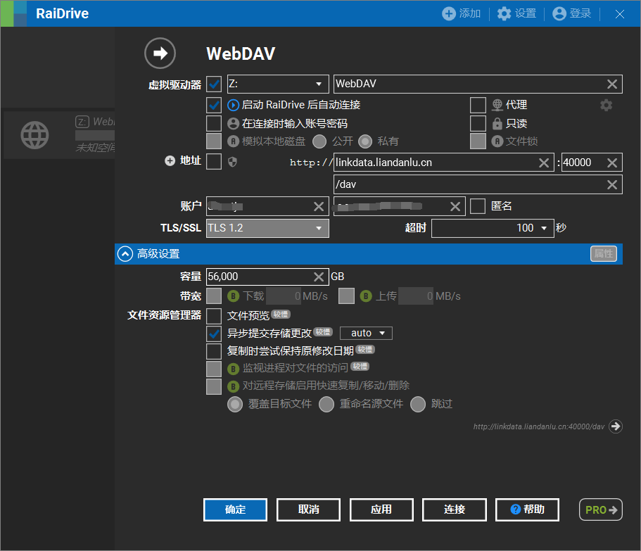
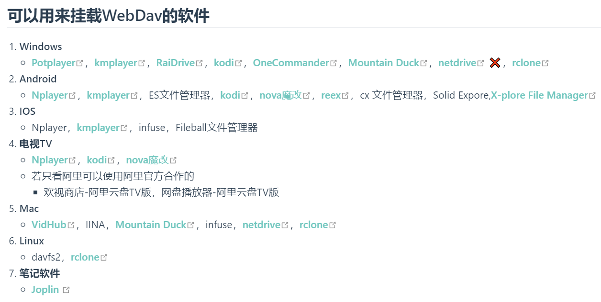

---
# This is the title of the article
title: NAS的使用
# This is the icon of the page
# icon: page
# This control sidebar order
order: 1
# Set author
author: fengjk
# Set writing time
date: 2023-09-01
# A page can have multiple categories
category:
  - GPU服务器文档
# A page can have multiple tags
tag:
  - 使用技巧
  - NAS存储
  - GPU服务器
# this page is sticky in article list
sticky: true
# this page will appear in starred articles
star: true
# You can customize footer content
footer: Footer content for test
# You can customize copyright content
copyright: No Copyright
---

:::tip
按照之前说的功能，本文将会介绍**不同终端如何挂载和使用nas**。
:::

# **nas的目录结构**

类似大U盘，他的目录如下：

nas里有两个目录：`public`，`resource`。
```text
┌ public
| |-huanghansheng
| |-zhangyide
| |-guanyunchang
| |...
├ resource
| |-ImageNet1k
| |-COCO
| |-VOC2017
| |...
```
- `public`目录为每个人存放数据的目录，用使用拼音命名；
- `resource`目录为存放数据集的目录，方便大家公用数据集；

>注：`private`目录因为权限问题已经移除（可能以后会添加回来）。


## ==容器端（必读、重点）==
在容器内，管理员已经为你挂载好了nas。

展示格式为：`nas的目录` $\xrightarrow{对应}$ `容器内的目录`：

`public/人名`$\xrightarrow{对应}$ `/root/nas-public-位置` 

`public`$\xrightarrow{对应}$ `/mnt/nas-public-位置` 

`resource`$\xrightarrow{对应}$ `/root/nas-resource-位置`

>容器中，目录的命名方式为：`nas-文件类型-服务器位置`，服务器位置目前有`linkdata`和`tju`。比如`nas-public-linkdata`为链数`public`目录。

自己按照自己的GPU服务器的所在位置使用目录，尽量不要跨地区访问。

::: tip 在容器中的的使用建议
- **定期将自己的文件移动到NAS内**，减少在其他目录上的数据量。

    这样做可以减少自己的容器大小，在进行容器迁移时会方便，也防止GPU存储空间爆满。

- 大的数据集放入`/root/nas-resource-linkdata`目录。 

- **日志与checkpoint定期**备份进入NAS。 

    NAS具有磁盘冗余设置，在一定量磁盘损坏的情况下，也可以保证数据不丢失，GPU内的磁盘则没有冗余，保护自己的重要数据，当心延毕。
    :::warning
    NAS具有文件恢复功能，NAS可以将整个文件、文件夹回滚到24h前（甚至一个月前）。如果误删了重要数据，请找管理员进行数据恢复。
    :::
:::

---
## **网页端**
nas可以通过浏览器直接访问，可以查看、下载、上传文件。

可以详细查看[AList章节](./alist.md)来获取详情。


---
## **Windows端**
Windows可以通过网络协议挂载nas，我们使用的协议是**WebDAV**。
下载[RaiDriver软件](https://www.raidrive.com/)，挂载nas到本地。
这样就可以在Windows端修改文件了。

{height=400}

配制WebDAV时请参考图片中填写的内容。

地址：http://linkdata.liandanlu.cn:40000/dav
**这是在Raidriver中填写的地址，不是在网之内输入的地址。**

**用户名和密码请登录alist网页端查看。**

---
## **手机端**
webdav协议


---
## **mac端**
webdav协议


---
## **ubuntu端**
webdav协议

