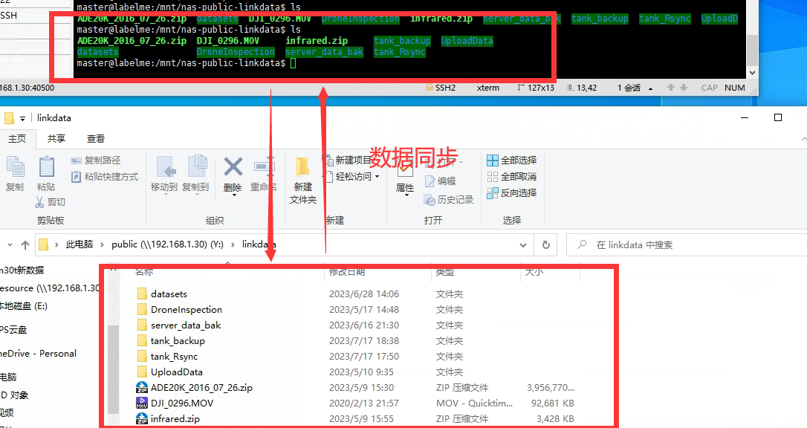
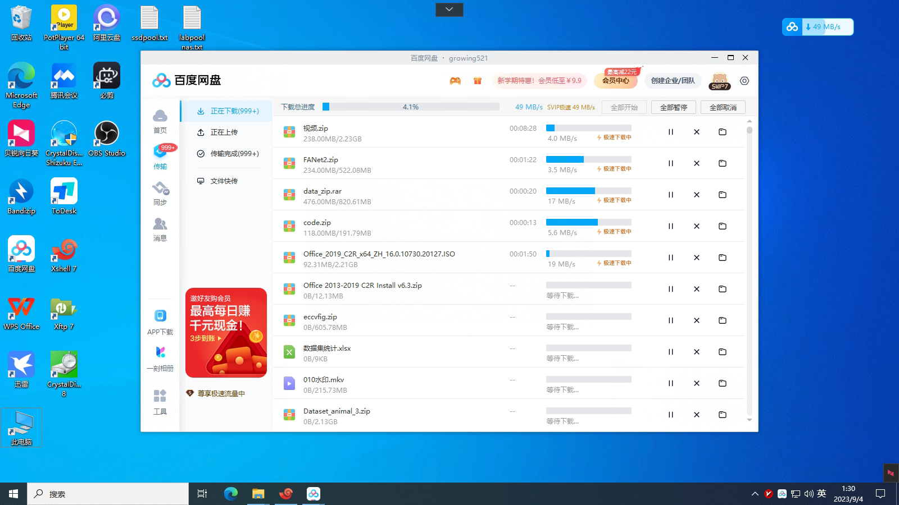
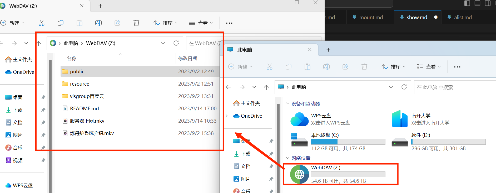
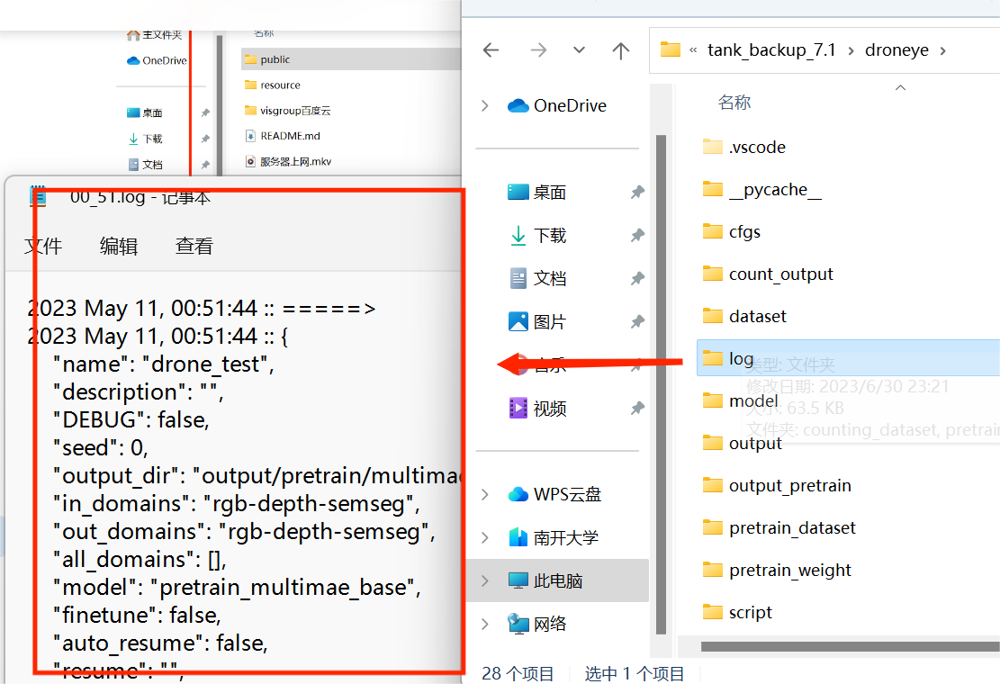

---
# This is the title of the article
title: 功能展示集锦
# This is the icon of the page
icon: eye
# This control sidebar order
order: 1
# Set author
author: fengjk
# Set writing time
date: 2023-09-01
# A page can have multiple categories
category:
  - GPU服务器文档
# A page can have multiple tags
tag:
  - 使用技巧
  - NAS存储
  - GPU服务器
# this page is sticky in article list
sticky: true
# this page will appear in starred articles
star: true
# You can customize footer content
footer: Footer content for test
# You can customize copyright content
copyright: No Copyright
---

## **网页在线观看视频**
可以流畅在线观看nas中的图片、视频。

## **多端同步**
手机、电脑、服务器均可以连接上nas，他们的数据是相通的。
相当于实验室的云盘系统，可以用来备份文件、同步数据。

## **离线下载**
在下载机上挂上下载程序即可，可以24h下载。

等下载完成之后拖入NAS即可。

## **windows端修改nas文件**
在windows中挂载之后，可以更方便查看、修改nas中的文件。

## **浏览日志**
在网页端、手机端、Windows端都可以随时浏览日志。

## **分享链接**

