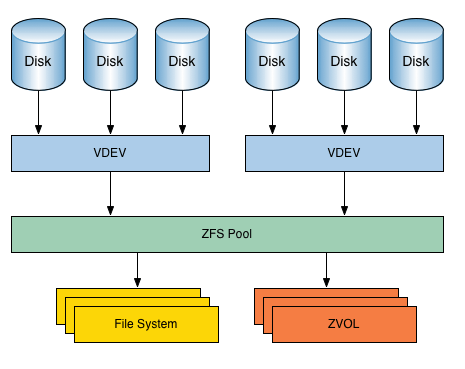

---
# This is the title of the article
title: zfs文件系统简介
# This is the icon of the page
icon: page
# This control sidebar order
order: 1
# Set author
author: fengjk
# Set writing time
date: 2023-04-08
# A page can have multiple categories
category:
  - 操作系统
# A page can have multiple tags
tag:
  - zfs
  - raid
  - 文件系统
# this page is sticky in article list
sticky: true
# this page will appear in starred articles
star: true
# You can customize footer content
footer: Footer content for test
# You can customize copyright content
copyright: No Copyright
---


## 一、 ZFS文件系统
推荐的详细[博客](https://szclsya.me/zh-cn/posts/storage/zfs-setup)
### 1. 什么是zfs文件系统
文件系统是操作系统中管理文件数据的一种东西。

比如Windows常用的的文件系统就是`NTFS`；U盘常用的文件系统就是`FAT32`；Linux常用的文件系统就有`ext4`之类的。
当格式化一个分区的时候，就需要选择一个文件系统进行格式化。

原来的文件系统有缺陷，比如`FAT32`不允许单个文件大小超过4G，`NTFS`又不开源。

ZFS也是一个文件系统，不过更加先进，并且可以进行很多管理操作。
其支持最大单个文件大小为 16 EB（1 EB = 1024 PB），
最大 256 千万亿（256*1015 ）的 ZB（1 ZB = 1024 EB）的存储

### 2. ZFS文件系统的优势
ZFS文件系统可以进行**磁盘软Raid**，进行磁盘的冗余与整合。
同时也可以很方便的进行扩容与缩容之类的，（跟LVM之类的差不多吧，不过zfs可以组raid。）

但是zfs比较吃内存，因为他将内存用户读写缓存，因此比较吃内存。

### 3. ZFS文件系统讲解

#### 3.1 几个概念
- `disk`磁盘，物理磁盘，就是一块一块的物理介质
- `vdev`虚拟设备，逻辑磁盘，就是将物理磁盘整合之后形成的虚拟逻辑设备
- `pool`存储池，由虚拟磁盘组成的存储池，相当于LVM中的逻辑卷组
- `dataset`数据集（`zvol`），在存储池中划分出来的一部分分区叫做数据集，就相当于`分区`




#### 3.2 管理方式以及如何使用

- 多个`磁盘(disk)`可以组成一个`vdev`；这个`vdev`可以选择磁盘的组成方式，可以选择`stripe`，`mirror`，`raid-z`等等方式（用来保证`vdev`的数据安全性，也就是`raid`）。损坏盘数超过限制，那么整个`vdev`数据将会损坏。
有硬盘损坏，那么可以`vdev`为单位重建。替换在命令行里分离（detach）损坏的磁盘，加入（add）新的磁盘，zfs会自动重建`vdev`重新恢复冗余性。
    
    - `stripe` 没有冗余
    - `mirror` 镜像文件
    - `raid-z` 一个磁盘冗余，允许损坏一个磁盘
    - `raid-z2` 两个磁盘冗余。允许损坏两个磁盘

- 多个`vdev`可以组成一个`池（pool）`，在一个`pool`中，每个`vdev`之间是`stripe`关系，也就是说**一个`vdev`损坏，整个池的数据丢失**。
一般来说，一个`pool`的`vdev`必须是同样的模式（比如说两个`vdev`组成`pool`，那么两个`vdev`不能一个是`raid-z`一个是`raid-z2`）。如果混合搭配会造成性能下降（不过也问题不大）。

 - `zfs`存储池可以设置缓存，缓存分为3中，读缓存`L2ARC`缓存（cache），写日志缓存ZIL `log`，元数据缓存`metadata`
 - `L2ARC`缓存损坏不会引起数据损失，其他写缓存损坏会导致原存储池损坏


- `数据集（dataset）`就是`池(pool)`里面的目录/分区，（如`/mnt/labpool/public`），可以在`池`里新建`数据集`。


### 4. 命令使用
安装zfs

```shell
sudo apt install zfsutils-linux
```


#### 4.1 创建存储池

- 创建一个新的存储池
```shell
zpool create <pool_name> [raidz|raidz2|raidz3|mirror] <disk>
```
其中`disk`也就是`/dev/sda`这些磁盘，但是更推荐使用`ID`绑定，这样可以防止硬盘位置变化对于硬盘名称的改变。因此请使用`/dev/disks/by-id/disk_name`创建池。

- 存储池设置挂载点，并且设置开机自动挂载
```shell
zfs set mountpoint=</mnt/挂载点> <pool_name>
```

#### 4.2 给存储池添加vdev
- 添加缓存`vdev`，其中`<cache_type>`就是之前介绍的几种类型（`cache`,`log`）
```shell
zpool add <pool_name> <cache_type> [raidz|raidz2|raidz3|mirror] <disk>
```
- 添加缓存`vdev`
```shell
zpool add <pool_name> [raidz|raidz2|raidz3|mirror] <disk>
```

#### 监控命令

- 监视容量和读取操作
```shell
zpool iostat
```

- 查看存储池状态
```shell
zpool status <pool_name>
```