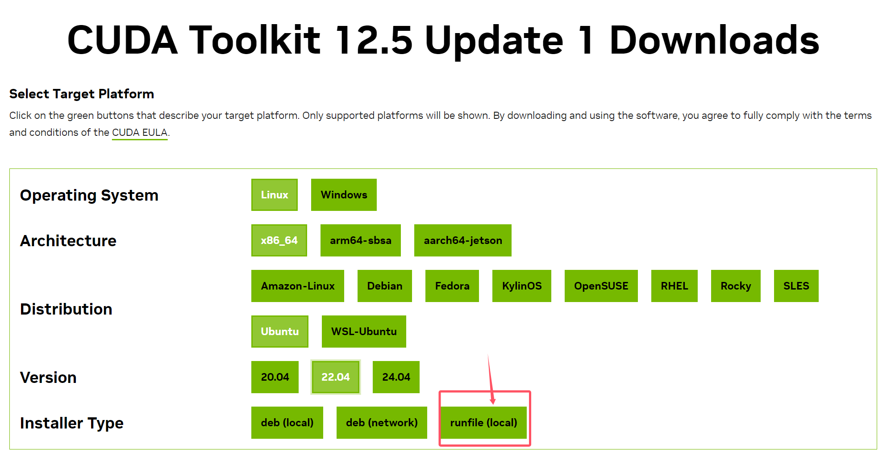
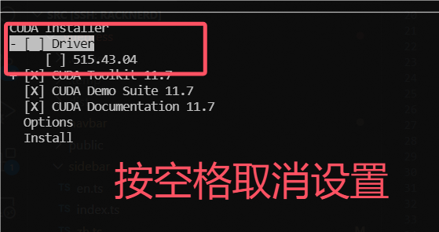

---
# This is the title of the article
title: cuda与nvcc安装
icon: microchip
# This is the icon of the page
# icon: more
# This control sidebar order
order: 2
# Set author
author: fengjk
# Set writing time
date: 2024-07-17
# A page can have multiple categories
category:
  - 环境安装
  - 显卡
  - cuda
# A page can have multiple tags
tag:
  - 使用技巧
# this page is sticky in article list
sticky: true
# this page will appear in starred articles
star: true
# You can customize footer content
footer: Footer content for test
# You can customize copyright content
copyright: No Copyright
---

:::tip 前言
目前安装pytorch是可以直接调用显卡运算的，不需要额外安装cuda与nvcc。

==请确保自己的项目确实需要单独的**CUDA**与**NVCC**，不合适的安装方式会导致驱动损坏。==
:::


## **CUDA安装**

- 安装依赖包，`g++`和`gcc`，安装过程中出现紫色界面直接回车。
```bash
apt install g++ gcc
```

- 下载英伟达的cuda安装包，并传到服务器上。在[官网](https://developer.nvidia.com/cuda-toolkit-archive)这里下载，挑选合适的版本，NAS中也有几个常用的版本已经下载好了。 **一般选择`.run`包下载并安装**。


<figure>

<figcaption>cuda下载，点击下载`.run`包</figcaption>
</figure>

查看自己服务器的操作系统的版本，可以使用`uname -a`命令。

如果你的网速太慢，可以在服务器上开启代理后，使用wget命令下载run包

```bash
wget https://developer.download.nvidia.com/compute/cuda/12.5.1/local_installers/cuda_12.5.1_555.42.06_linux.run
```


- 使用`sh`命令安装包

```bash
sh cuda_12.5.1_555.42.06_linux.run
```

- 安装途中，会出现安装组件选项，==一定要要取消`Driver驱动`选项==。
<figure>

<figcaption>取消驱动选项</figcaption>
</figure>

- 配置环境变量，使用命令在`~/.bashrc`中增加环境变量设置。

```bash
export LD_LIBRARY_PATH=$LD_LIBRARY_PATH:/usr/local/cuda/lib64
export PATH=$PATH:/usr/local/cuda/bin
export CUDA_HOME=$CUDA_HOME:/usr/local/cuda
```

- 然后重开一个命令行，使用下面命令检查是否安装成功，如果有正常输出，那就安装成了。
```bash
nvcc -V
```

## **NVCC安装**

:::danger 不要使用apt指令安装nvcc
使用系统提示的`apt install`安装nvcc, 会导致驱动损坏。

如果你已经这样做了，导致`nvidia-smi`等指令无法正常使用，请尝试卸载驱动，清除所有英伟达残留。
:::


- 首先安装cuda，参考上面流程安装完成cuda。如果你的环境变量设置正确，那么nvcc就安装成功了，下面的指令也可以正常运行。
```bash
nvcc -V
```


## **清除英伟达驱动**

:::danger 仅限于驱动损坏时使用
如果`nvidia-smi`等指令无法正常使用，请尝试卸载驱动，清除所有英伟达残留。

卸载完成后重启容器，然后检查你的`pytorch`和`nvidia-smi`是否能正常调用显卡，出现问题请联系管理员。
:::


- 使用如下命令清除显卡驱动：
```bash
apt-get purge nvidia-*
apt autoremove
```
