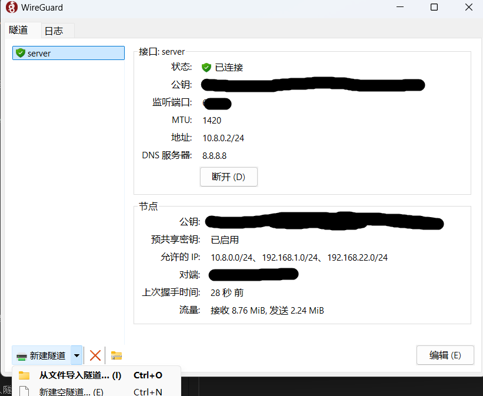

---
# This is the title of the article
title: 链数VPN使用
icon: link
# This is the icon of the page
# icon: more
# This control sidebar order
order: 2
# Set author
author: fengjk
# Set writing time
date: 2024-03-24
# A page can have multiple categories
category:
  - SSLVPN
# A page can have multiple tags
tag:
  - 使用技巧
  - 网络安全
# this page is sticky in article list
sticky: true
# this page will appear in starred articles
star: true
# You can customize footer content
footer: Footer content for test
# You can customize copyright content
copyright: No Copyright
---

:::tip 前言
非`liandanlu.cn`域名连接链数服务器，需要使用SSLVPN连接，保护通信安全。

此方式无法使用公共nas。
:::

:::caution 维护SSLVPN的安全性
由于之前链数服务器遭到了病毒攻击，大量数据受损，引起开启了SSLVPN进行身份验证，这是进入公司内网的最后一道防火墙，请保护好SSLVPN的帐密；

目前有两种VPN，请按照管理员给你的推荐使用。
:::


## 锐捷SSLVPN登录方式如下：

- 下载锐捷SSLVPN软件，[下载官网](https://www.ruijie.com.cn/fw/wt/82396/)

- 选择适合自己操作系统客户端的软件进行安装


- 登录sslvpn软件：地址`https://123.150.46.205:53628`

==sslvpn账号密码与服务器的的账号密码不同，注意区分==

<figure>

<figcaption>sslvpn登录</figcaption>
</figure>


- 登录成功之后，在xshell等软件中使用`192.168.xx.xx`地址即可连接到服务器

<figure>

<figcaption>sslvpn登录成功</figcaption>
</figure>


## WireGuard登录方式：

WireGuard 是一个跨平台的、现代化、易于管理的软件，具有负载小、快速、高效的特点。以下是使用 WireGuard 进行登录的详细步骤：

WireGuard 是一个跨平台的、现代化、易于管理的软件，具有负载小、快速、高效的特点。以下是使用 WireGuard 进行登录的详细步骤：

- 1. 下载 WireGuard 软件:

首先，你需要在你的设备上下载并安装 WireGuard 客户端软件。WireGuard 支持多种操作系统，
在[官方网站](https://www.wireguard.com/install/)进行下载安装。

- 2. 导入配置文件:

  - 下载并安装 WireGuard 软件后，你需要导入管理员提供给你的 VPN 配置文件来建立连接。配置文件扩展名通常为 `.conf` 或 `.wg`。
  - 在 Windows 或 macOS 上，打开 WireGuard 客户端，点击“导入隧道配置文件”，选择你收到的 .conf 文件，导入完成后，隧道将出现在列表中。
  - 在 Linux 上，可以通过以下命令导入配置文件：
  ```bash
  sudo wg-quick up /path/to/your-config-file.conf
  ```
  - 在 iOS 或 Android 上，打开 WireGuard 应用，点击“创建隧道”，然后选择“从文件或存储库导入”，选择你收到的配置文件即可。


<figure>

<figcaption>wireguard安装并配置</figcaption>
</figure>


- 3. 验证登录效果
  - 导入配置文件并成功创建隧道后，你需要验证 WireGuard 的连接是否正常工作。
  - 在客户端中，启动连接后，你应该会看到连接状态变为“已连接”或类似状态，并显示一些连接的详细信息，例如 VPN 服务器的 IP 地址、流量统计等。
  - 测试是否可以ping通服务器
  ```bash
  ping 192.168.22.1
  ```
