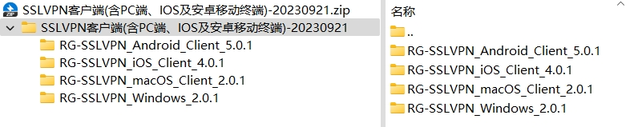
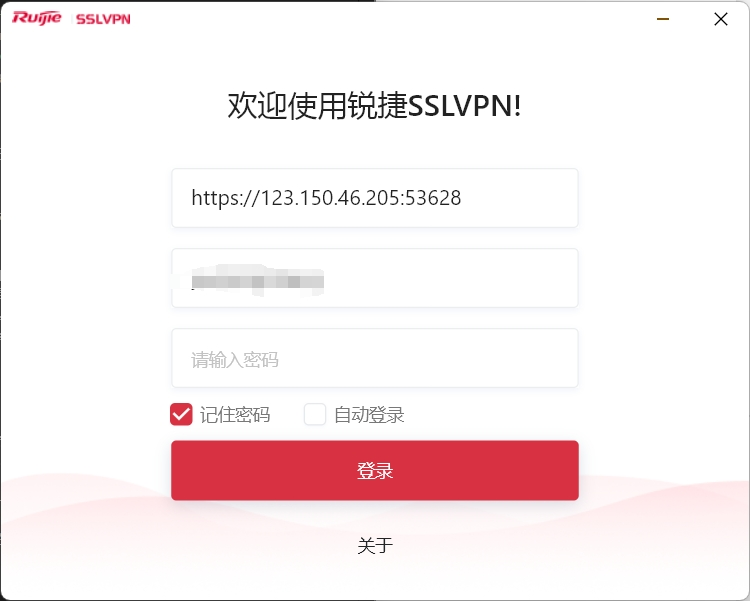
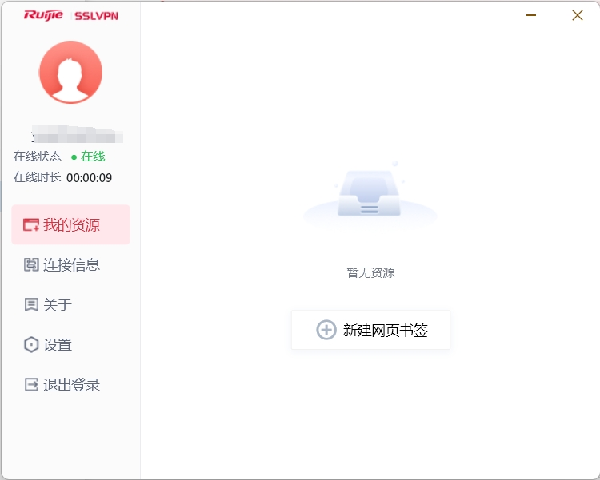

---
# This is the title of the article
title: 链数SSLVPN使用
icon: link
# This is the icon of the page
# icon: more
# This control sidebar order
order: 2
# Set author
author: fengjk
# Set writing time
date: 2024-03-24
# A page can have multiple categories
category:
  - SSLVPN
# A page can have multiple tags
tag:
  - 使用技巧
  - 网络安全
# this page is sticky in article list
sticky: true
# this page will appear in starred articles
star: true
# You can customize footer content
footer: Footer content for test
# You can customize copyright content
copyright: No Copyright
---

:::tip 前言
非`liandanlu.cn`域名连接链数服务器，需要使用SSLVPN连接，保护通信安全。

此方式无法使用公共nas。
:::

:::caution 维护SSLVPN的安全性
由于之前链数服务器遭到了病毒攻击，大量数据受损，引起开启了SSLVPN进行身份验证，这是进入公司内网的最后一道防火墙，请保护好SSLVPN的帐密；
:::

登录方式如下：

- 下载锐捷SSLVPN软件，[下载官网](https://www.ruijie.com.cn/fw/wt/82396/)

- 选择适合自己操作系统客户端的软件进行安装

- 登录sslvpn软件：地址`https://123.150.46.205:53628`

==sslvpn账号密码与服务器的的账号密码不同，注意区分==

<figure>

<figcaption>sslvpn登录</figcaption>
</figure>

- 登录成功之后，在xshell等软件中使用`192.168.xx.xx`地址即可连接到服务器

<figure>

<figcaption>sslvpn登录成功</figcaption>
</figure>
