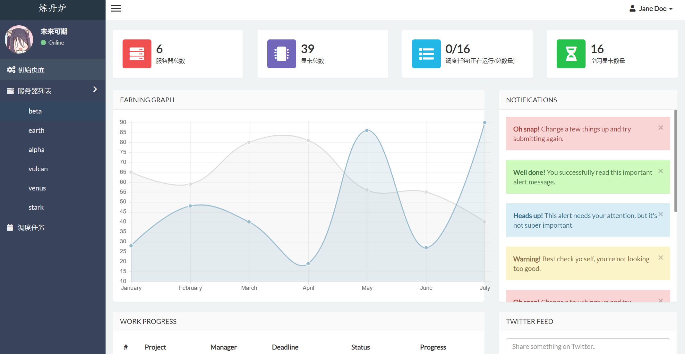
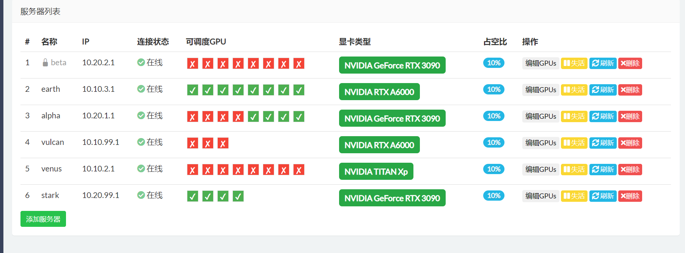
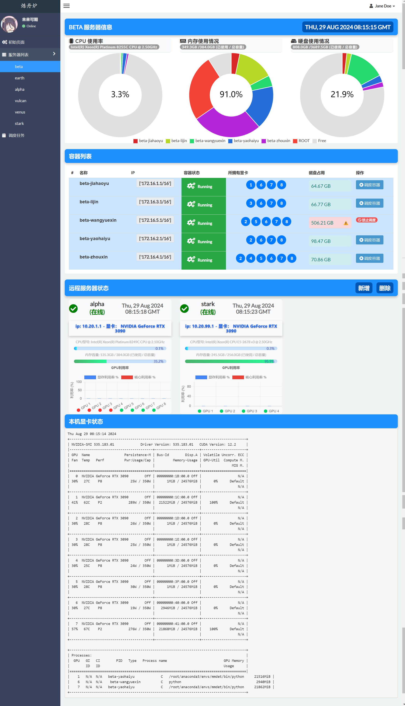
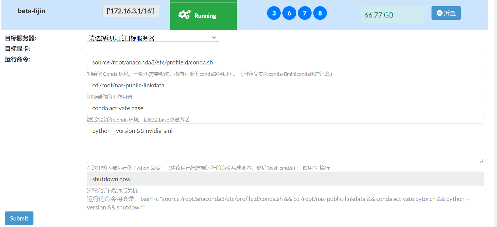
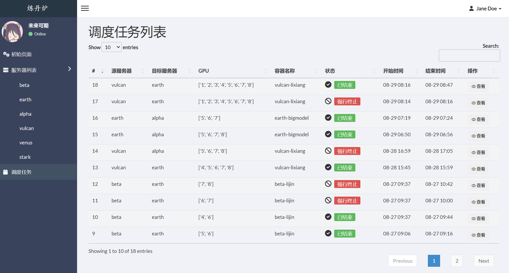

---
# This is the title of the article
title: 容器调度工具
icon: dolly
# This is the icon of the page
# icon: more
# This control sidebar order
order: 2
# Set author
author: fengjk
# Set writing time
date: 2024-08-29
# A page can have multiple categories
category:
  - 容器调度
# A page can have multiple tags
tag:
  - 使用技巧
  - 调度系统
# this page is sticky in article list
sticky: true
# this page will appear in starred articles
star: true
# You can customize footer content
footer: Footer content for test
# You can customize copyright content
copyright: No Copyright
---

::: tip 前沿
目前容器调度方案正在内测阶段，功能不完善。可能存在恶性bug，禁止非内测人员使用，禁止长时间占用GPU。

目前只在内网进行测试，你需要使用VPN连接到内网，参考[文档](./01-sslvpn.md)。
:::

按照如下步骤开始你的调度：

## 1. 登录调度控制中心

目前调度中心为网页端，按照管理员给你的网址登录使用。
登录后的网页如下:

<figure>

<figcaption>首页样式</figcaption>
</figure>

### 首页结构：

- 侧边栏主要负责进入不同区域进行导航，用于跳转不同界面

- 首页最下方为服务器列表，展示一些服务器信息。**==非管理员禁止操作==**。

    主要内容为`服务器名称`，`服务器IP` `服务器连接状态` `服务器哪些GPU可以被调度` `显卡类型`等。
    <figure>
    
    <figcaption>服务器列表</figcaption>
    </figure>

## 2. 服务器详情

从侧边栏进入你所在的服务器。服务器详情页面主要分为下面几个方面：

    <figure>
    
    <figcaption>服务器详情</figcaption>
    </figure>

### 详情页结构

- 最上方是服务状态的饼状甜甜圈图，可以看到每个人的占用情况，如果资源不够用，请自己联系占用多的人进行协调。

- 中间是容器列表，显示这台服务器上所有容器的信息、运行状态、所拥有的显卡。如果你们使用冲突请自行协调。
**如何使用调度功能后文会介绍**。

**==容器调度功能位于右侧的按钮中==**

::: caution 内测期间遵守用户准则

1. 只调动、管理自己的容器和任务；
2. 停止任务的时候，请核对信息是否准确，是不是别人的任务；
3. 用户只进行调度操作，禁止编辑服务器列表、禁止编辑远程服务器状态、禁止自行构建请求发送给后端api。
:::

- 远程服务器列表，其中显示了可以作为调度目标的服务器以及其工作状态，绿色圆点表示可以作为调度目标的显卡。

- 服务器显卡状态，显示了本服务器的`nvidia-smi`状态，其中显示了运行gpu进行的容器名称，如果发生冲突请自行联系。

### **如何进行任务调度**
<figure>

<figcaption>容器调度</figcaption>
</figure>

1. 选择调度的目标服务器
2. 选择目标显卡
3. 设置容器需要运行的命令，包括环境激活、进入工作目录、运行python程序
4. 点击提交
:::tip 注意事项
1. 调度的容器运行完会释放掉，所以请把你的日志、checkpoint等存入nas中，防止被释放
2. 这种方法并不能加载全部环境变量，可以把执行的命令换成`bash bash.sh`脚本，然后在脚本中导入你需要的环境变量，可能包含`CUDA_HOME`等。
3. 进行调度之前，检查目标显卡、目标服务器有没有人占用，内测阶段并没有做完善的任务锁。
:::

## 3. 任务列表

从侧边栏进入任务列表，或者提交任务后自动跳转任务列表，可以查看任务日志以及终止任务。
<figure>

<figcaption>任务列表</figcaption>
</figure>

