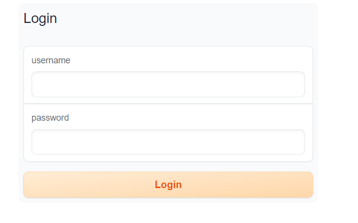
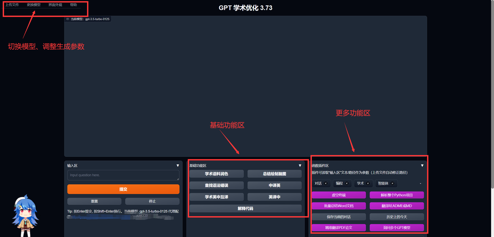
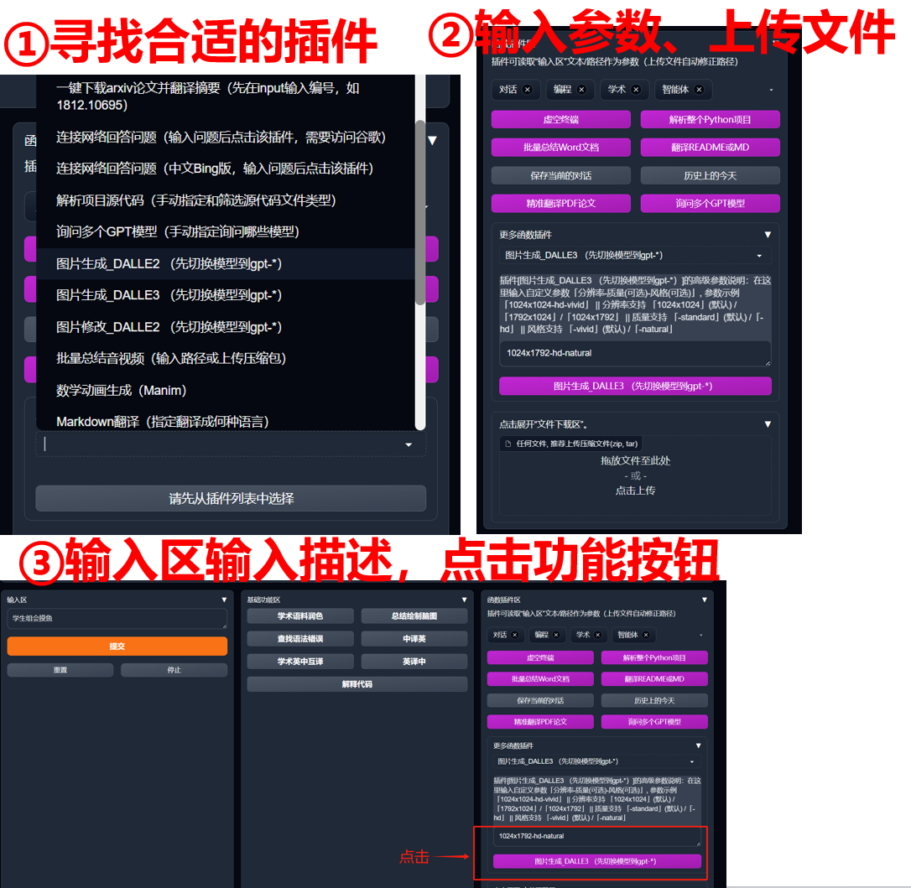
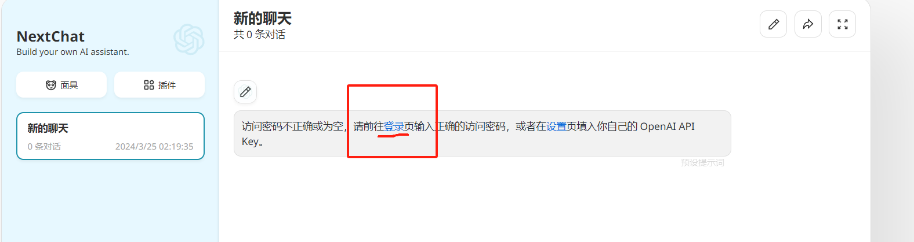
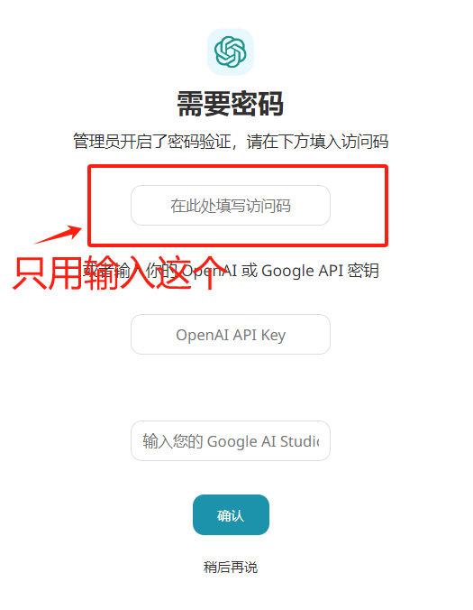
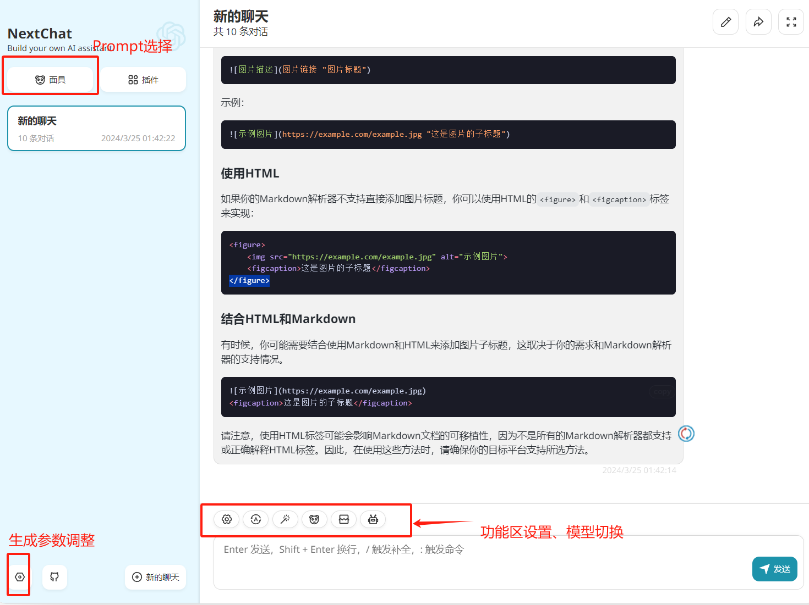
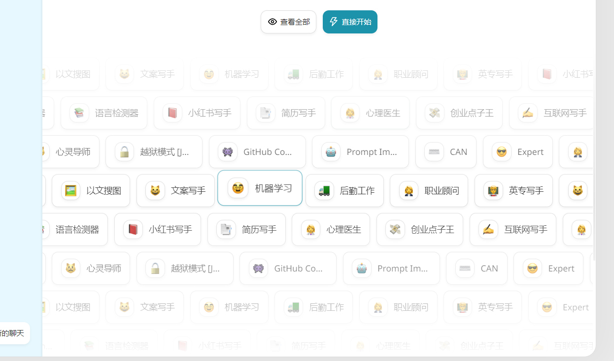
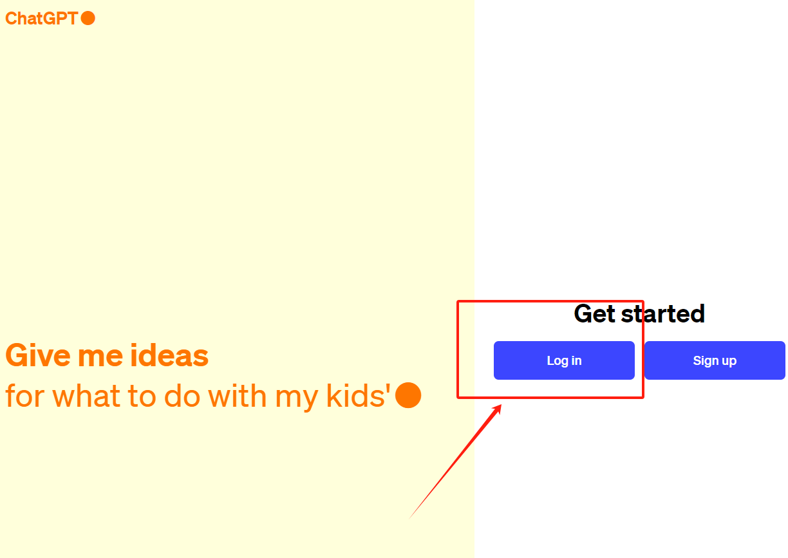
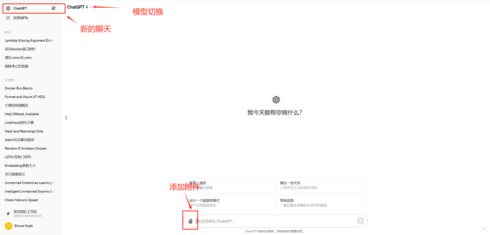

---
# This is the title of the article
title: 实验室GPT工具使用
icon: comments
# This is the icon of the page
# icon: more
# This control sidebar order
order: 2
# Set author
author: fengjk
# Set writing time
date: 2024-03-24
# A page can have multiple categories
category:
  - GPT使用
# A page can have multiple tags
tag:
  - 使用技巧
# this page is sticky in article list
sticky: true
# this page will appear in starred articles
star: true
# You can customize footer content
footer: Footer content for test
# You can customize copyright content
copyright: No Copyright
---

:::tip 前言
实验室提供GPT3.5/4等科研工具，大家可以使用工具**润色论文**, **改进代码**等.

部分功能需要翻墙，然后连接openai，如果无法欠费/无法翻墙，请联系管理员。
:::

:::danger 做好保密限制
①实验室所使用的工具为“按量付费”机制，请勿将密码向外分享。  否则花费会过高，或者导致共享账号被封；

②如果需要大量使用工具（如使用ChatGPT生成大规模数据集），需要提前做好成本预算([成本计算网站](https://openai.com/pricing))，然后与管理员和老师联系，获取批准。
:::

## 使用方法

实验室目前准备了3个平台：①学术版GPT，②ChatNextWeb，③官网登录

网址、帐密等内容在Alist网页中查看，访问方式详见[Alist使用方式](/Userdocs/nas/alist.md)

对于无法翻墙的同学，建议使用前两种方式。第三种方式需要登录OpenAI官网。

### ①学术GPT登录

- 在网页内输入**学术GPT**网址，可以看见如下界面，输入帐密登录：

<figure>

<figcaption>学术GPT第一次登录界面</figcaption>
</figure>

- 正式进入之后，界面如下，分为不同功能区，结合自己的需求使用
  - 需要切换模型，或者调整生成参数，在左上角调整
  - 基础功能使用方式：在输入框输入文字之后，点击“功能区”按钮
  - 复杂功能使用：调出插件后， 输入参数、文字描述， 点击插件按钮

<figure>

<figcaption>学术GPT使用界面</figcaption>
</figure>

<figure>

<figcaption>插件使用步骤</figcaption>
</figure>

### ②Chat-Next-Web使用

- 进入Chat-Next-Web网址，选择“登录”，然后输入密码
<figure>

<figcaption>NextChat登录界面</figcaption>
</figure>

<figure>

<figcaption>输入密码</figcaption>
</figure>

- 这个使用方式更加美观，并且拥有更多的prompt预设选项

<figure>

<figcaption>使用界面</figcaption>
</figure>

<figure>

<figcaption>ChatNextWeb的Prompt</figcaption>
</figure>

### ③官网登录
- 进入[OpenAI官网](https://chat.openai.com/)，输入帐密登录

<figure>

<figcaption>OpenAI登录界面界面</figcaption>
</figure>

- 官网功能较多，包括**图像生成**， **文件总结**， **图片分析**等功能，包含一些更新的最新特征，可以自行探索。
==但是官网目前使用数量限制为“每小时30条信息”，实验室多人使用可能超额。如果超过数量，请使用前两种方式（前两种不限量）== 

<figure>

<figcaption>ChatGPT使用</figcaption>
</figure>
